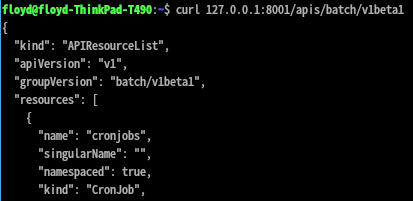
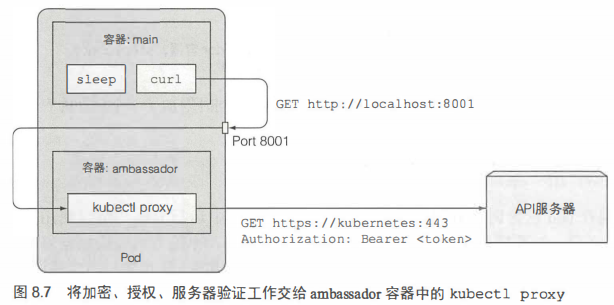

# Kubernetes简介

## 是什么

Kubernetes是一个软件系统， 允许部署和管理**容器化**的应用

## 工作原理

大致工作原理如下：

1. 用户开发自己的应用， 完成后打包成容器镜像，比如Docker，发布到容器注册平台
2. 用户编写应用描述信息，说明应用需要以怎样的组合方式进行运行
3. 通过kubernetes控制面板将描述信息传入。kubernetes节点从容器注册平台获取用户开始发布的镜像，进行运行。
4. 整个运行期间，kubernetes持续监控应用的部署状态是否与描述文件中的一致，如果单个节点或实例宕机了，则会自动重启该节点，从而保持应用的活跃。

## kubernetes优势

- 简化应用部署
- 更好滴利用硬件
- 健康检查和自我修复
- 自动扩容

## POD

对于我们来说，在Kubernetes中运行的最小单位是容器，即Docker镜像。但对于Kubernetes来说却不是这样的，它并不直接处理单个容器，而是处理多个共存容器的理念，这组容器叫做POD

一个POD的一组紧密相关的容器，他们总是同时运行在一个节点上，以及同一个linux命名空间中。

每个POD就像一台独立的逻辑机器，拥有自己的IP、主机名、进程等，运行一个独立的应用程序。


### 注意

由于Kubernetes的最小单位是POD，因此并不能列出单个容器，只能列出POD

## 应用发布到K8S完整流程

下面展示了一个完整的容器发布到K8S的流程


## 服务

我们的应用被打包成镜像，运行在容器中，容器在K8S中位于POD中，要访问我们的应用，就要通过IP地址访问POD，但这个IP地址是集群内部的，无法通过外网访问。

要访问到POD，就要通过服务对象将其公开。可以创建一个外部的负载均衡服务，通过负载均衡的公共IP访问POD。

服务存在的另一个关键原因，在于POD的存在可能是短暂的，可能因为K8S内部资源调配，使得一个POD被迁移到另一个节点，也可能一个POD因为某种原因挂掉或消失，存在一个稳定的服务，不管POD如何变化，都能将用户的访问转发给目标POD。

## 服务、POD、ReplicationController的关系


可以看到，我们是以POD为中心的，服务用于暴露外部IP给用户，ReplicationController用于在POD挂掉时马上重启一个新的POD。

如下展示了当存在多个POD时候的状态


# POD

POD是K8S中最为核心的概念，而其它对象仅仅是用于管理、暴露POD或被POD使用。

POD是一组并置的容器，代表K8S中的基本偶见模块。

## 基础

### 为什么需要pod

容器的目的，是要在一个容器中仅运行一个进程（启动子进程除外），这是因为如果一个容器内运行多个进程，容器还需要负责进程管理、日志管理等繁复工作，这就是docker期望解决的问题。

docker解决了单个容器对应的多进程问题，那么原本需要相互关联的进程就变成了相互关联的容器关系，这种更加高级的关系就由pod来解决。

### 同一个pod中容器的部分隔离

docker容器之间是完全相互隔离的，但同一个pod中的所有容器都共享相同的主机名和网络接口，其它还是隔离。由于共享相同的IP地址和端口空间，因此同一个pod中的容器不能绑定到相同的端口，否则会冲突。

### pod间网络

k8s集群中所有pod都在同一个共享的网络地址空间中，所以pod之间可以直接通过IP地址进行互访，不需要经过网关，就像局域网一样，因此他们的访问是非常直接简单的。

### pod的容器管理策略

pod可以被视为独立的机器，且由于它比较轻量，因此我们可以轻易拥有尽可能多的pod。

pod的推荐策略是，除了关系非常紧密的组件或进程放在一个pod外，其它情况最好只一个pod对应一个进程。原因有二

- pod是k8s扩容的基本单位，一个pod对应一个进程更加具有弹性
- 一个pod只能部署在一个节点，分多个pod更加容易在多个节点之间平衡，充分利用节点资源。

## 通过配置文件创建POD

一个配置文件示例

```yml
apiVersion: v1
kind: Pod
metadata:
        name: kubia-manual
spec:
        containers:
                - image: zou8944/kubia
                  name: kubia2
                  ports:
                          - containerPort: 8080
                            protoctl: TCP
```

```shell
# 创建pod
kubectl create -f kubia-manual.yaml # 甚至都不用指定创建什么，因为配置文件中已经说明了创建对象
```

## 查看应用程序日志

### 方式一

使用ssh登录到pod正在运行的节点，然后使用docker logs命令获取对应容器的日志

### 方式二

直接使用kubectl logs \<pod name>获取pod的日志

## 将本地端口转发到pod中的端口

在不通过service的情况下与特定的pod通信，通常是调试时需要用到，可以将本地网络端口转发到远端集群中的pod

```shell
kubectl port-forward kubia-manual 8888:8080 # 将本机的8888端口转到到目标pod的8080端口
```


## 标签

### 基本

标签是K8S简单且强大的特性，可以应用于任何资源。简单地讲，他就是可以应用于任何资源的键值对。

- 标签可以在创建时pod时指定

  ```shell
  ......
  metadata:
    name: kubia-manual
    labels:
    	creatingMethod: manual
    	env: prod
  ......
  ```

- 也可以直接添加或修改标签

  ```shell
  # 手动添加一个标签
  kubectl label po kubia-manual creation_method=manual
  # 手动覆盖原有的标签
  kubectl label po kubia-manual enb=debug --override
  ```

### 标签选择器

标签结合标签选择器可以带来丰富的效果

```shell
# 单个条件
kubectl get po -l creation_method=manual
kubectl get po -l creation_method!=manual
kubectl get po -l env
kubectl get po -l '!env'
kubectl get po -l env in (prod, dev)
kubectl get po -l env notin (prod, dev)
# 多个条件
kubectl get po -l creation_method=manual, env in (prod, dev)
```

### 使用标签选择器约束pod调度

让pod随机调度是k8s最为理想的调度，但有时由于硬件或是其它因素导致的需要约束pod调度。

方式是为node添加标签，再在pod创建时利用标签选择器约束其在符合条件的节点上部署

```shell
# 将一个节点添加标签 gpu=true
kubectl label node gke-kubia-default-pool-e4a13557-8mqq gpu=true
```

然后在创建时指定选择器

```yaml
......
spec:
	nodeSelector:
		gpu: "true"
	containers:
......
```

## 注解

注解同样可以用于所有k8s资源，也是键值对。与标签不同的是它没有注解选择器，但能够容纳更多信息（不知道过256KB）。

```shell
# 创建注解
kubectl annoteate pod kubia-manual hello="true"
# 查看注解，使用describe命令可以查看注解内容
kubectl describe pod kubia-manual
```

## 命名空间

使用标签可以将对象分为多个有重叠的组。但在完全不需要重复的情况下，可以将对象分组到不同的命名空间中。

比如k8s默认将系统相关的node放在kube-system命名空间中，将我们的node放在default命名空间中，这样不会显得混乱，还能防止用户误删除。

### 创建命名空间

和pod一样，命名空间在k8s中液仅仅是一个资源，因此可以通过yaml文件创建

```yaml
apiVersion: v1
kind: Namespace
metadata:
	name: my-first-namespace
```

当然也可以通过命令行直接创建

```shell
kubectl create namespace my-first-namespace
```

### 管理命名空间中的对象

创建一个资源（不一定是pod哦）时指定命名空间，可以两种方式

- 在metadata字段添加  namespace字段指定命名空间

- 也可以在创建时指定命名空间

  ```shell
  kubectl create -f kubia-manual.yaml -n custom-namespace
  ```

### 别误会

命名空间并不提供正在运行的对象的任何隔离，仅仅是让我们在管理时候分离开来。当然这也不一定，我们说得是默认情况。

## 删除pod

```shell
# 按名称删除pod
kubectl delete pod <pod name>
# 使用标签选择器删除pod
kubectl delete po -l creation_method=manual
# 通过删除整个命名空间来删除pod
kubectl delete ns custom-namespace
# 删除命名空间的所有pod，但保留命名空间
kubectl delete po --all
```

我们如果直接删除pod，会发现马上又会重新启动一个pod。这是replicationController在作怪，因为他会保证一致有一个pod在运行。因此要彻底删除必须同时删除该rc

```shell
# 删除所有资源，包括rc, service等
kubectl delete all --all
```

上述命令也会删除kubernetes的service，但这没有关系，因为几分钟后会自动重建。


# 管理POD

## 保持pod健康

k8s能够做到即使应用程序的进程没有崩溃，仅仅是应用停止响应，也能够重启应用程序。

### 使用存活探针

存活探针检测容器是否还允许，有三种机制

- HTTP GET请求应用给出的IP地址，不返回数据或是返回错误状态码将会导致重启
- TCP套接字探针，与容器指定端口建立连接，建立失败则导致重启
- Exec探针，在容器内执行任意命令，执行结果的状态码非0则重启

### HTTP探针

```yaml
......
spec:
	containers:
	- image: zou8944/kubia
	  name: kubia
	  # 指定路径为/，端口为8080的http探针
	  livenessProbe:
	  	httpGet:
	  		path: /
	  		port: 8080
	  	initialDelaySeconds: 15  # 在第一次探测前等待15秒，用于等待容器启动
......
```

## ReplicationController

是一种k8s资源，可确保它的pod始终处于运行状态。没有RC管理的pod在终止后不会被重新创建。

RC对pod的跟踪，是使用标签选择器来进行的。


RC三个重要组成部分

- 标签选择器
- 副本个数 
- pod模板：用于创建新的pod副本

pod和rc的联系仅在标签选择器，当该条件获取的结果不满足副本个数时，将会使用pod模板进行闯将。

### 创建

使用yaml创建

```yaml
apiVersion: v1
kind: ReplicationController
metadata:
	name: kubia
spec:
	# 确保的pod实例数量
	replicas: 3
	# selector决定了RC的操作对象
	selector: 
		app: kubia
	# 创建新pod时的模板
	template:
		metadata: 
			labels: 
				app: kubia
		spec:
			containers:
				- name: kubia
				  image: zou8944/kubia
				  ports:
				  	- containerPort: 8080
```

### 删除

可以删除RC，但当通过kubectl delete删除时，对应的pod也会被删除。由于RC和POD只是管理与被管理的关系，因此可以做到只删RC而不删除POD

```shell
# 删除rc及其管理的POD
kubectl delete rc <rc name>
# 仅删除rc，不删除POD
kubectl delete rc <rc name> --cascade=false
```

## ReplicaSet

ReplicaSet是新一代的ReplicationController，并且最终会取代RC。所以实际使用中应该使用RS，而不是RC。上文中创建那么多RC只是为了学习演示。

### 与RC相比有何优势

行为上与RC完全相同，但是其标签选择器具有更强的表现力。

### 创建

```yaml
apiVersion: apps/v1beta2  # 版本必须是这个（不知道现在的版本还是不是）
kind: ReplicaSet
metadata: 
  name: kubia
spec:
  replicas: 3
  selector:
    matchLabels:
      app: kubia
  template:
    metadata:
      labels:
        app: kubia
    spec:
      containers:
        - name: kubia
          image: zou8944/kubia
```

### 强大的选择器示例

```yaml
......
spec:
  replicas: 3
  selector:
    matchExpression:
      - key: app
        oprator: In # 支持的操作：In NotIn Exists DoesNotExist
        values:
        	- kubia
......
```

## DaemonSet

适用于需要在每个节点上都运行一个pod的情况，比如一些基础设施。最典型的例子就是kube-proxy进程

DaemonSet确保在符合条件的节点上运行一个指定的pod：新节点加入时主动创建一个pod，一个节点下线时不做任何操作

### 创建

```yaml
apiVersion: apps/v1beta2
kind: DaemonSet
metadata: 
  name: ssd-monitor
spec:
  selector:
    matchLabels:  # 匹配POD的节点
      app: ssd-monitor
  template:
    metadata:
      labels:
        app: ssd-monitor
    spec:
      nodeSelector:  # 该节点选择器用于匹配节点
        disk: ssd
      container:
        - name: kubia
          image: zou8944/kubia
```

### 删除

```shell
# 获取所有DaemonSet
kubectl get ds
```

## Job

RC, RS, DS都会持续运行任务，永远达不到结束态。如果需要一种任务，完成工作后就马上结束，Job就很适用。

Job会在pod未成功执行完成而异常退出时重新启动一个pod，如果成功完成了则不再启动。

### 创建

```yaml
apiVersion: batch/v1
kind: Job
metadata: 
  name: batch-job
spec:
  template:
    metadata:
      labels:
        app: batch-job
    spec:
      completions: 5 # 将此容器顺序运行5个pod
      parallelism: 2  # 最多两个pod可以并行运行
      activeDeadlineSeconds: 30 # pod运行30秒还没有成功就中止并重试
      restartPolicy: OnFauilre
      containers:
        - name: main
          image: zou8944/batch-job
```

```shell
# job运行时手动将并行运行个数改为3个
kubectl scale job batch-job --replicas 3
```

## CronJob

在特定时间或特定间隔时间运行的Job

### 创建

```yaml
apiversion: batch/v1beta1
kind: CronJob
metadata:
  name: periodic-batch-job
spec:
  schedule: "0, 15, 30, 45, * * * * " # 每天的每小时的0,15,30,45分钟运行一次
  startingDeadlineSeconds: 15  # pod最迟必须在预定时间的15秒内开始（可选）
  jobTemplate:
    spec:
      template: 
        metadata:
          labels:
            app: periodic-batch-job
        spec:
          restartPolicy: OnFailure
          containers:
            - name: main
              image: zou8944/batch-job
```

### 时间表解释

从左到右依次代表

- 分钟
- 小时
- 每月中的第几天
- 月
- 星期几 （0代表周天，以此类推）

### 原理

CronJob会创建Job，Job再去创建pod。

# Service

第二章已经说过了Service存在的意义，主要是由于POD机制无法对外提供一个稳定的地址，因此需要服务进行固定地址的暴露和负载均衡。

官方一点的话：k8s的服务是一种为一组功能相同的pod提供单一不变的接入点的资源。

## 基础

### 创建服务

#### 方法一

通过expose命令创建

```shell
kubectl expose rc kubia --type=LoadBalancer --name kubia-http
```

#### 方法二

使用yaml创建，如下针对所有具有标签app=kubia的node创建了一个服务，对外端口为80，对内端口为8080

```yaml
apiVersion: v1
kind: Service
metadata:
  name: kubia
spec:
  sessionAffinity: ClientIP # 会话亲和性：同一个客户端请求到的POD会是同一个。（可选）
                                                    # 支持none/ClientIP，不支持cookie，因为k8s并非基于http，而是TCP
  ports:
    # 端口可以暴露多个
    - name:  http  # 名字是可选的
      port: 80
      targetPort: 8080
    - name: https
      port: 443
      targetPort: 8443
    selector:
      app: kubia
```

会话亲和性：正常情况下，每次来自客户端的请求都会被服务随机转发到一个pod，但如果想要一个客户端的请求一直在单个pod中执行，就需要向上面那样配置会话亲和性。

### 服务发现

#### 方法一 环境变量

此方法前提是服务创建早于pod的创建。可通过在pod中执行env获取环境变量，会有响应服务的IP和端口

#### 方法二 DNS

通过k8s的系统pod——kube-dns实现，具体操作方式尚不知晓

####  方法三 FQDN

Full Qualified Domain Name(FQDN)，全限定域名。一个服务的全限定名长这样，访问它就可以，原因我也不知道

`backend database.default svc cluster. l ocal`

## 连接集群外的服务

即不要让服务将连接重定向到集群中的pod，而是重定向到外部的IP和端口。

### Endpoint

就是暴露一个服务的IP和端口列表的k8s资源

创建服务时指定的标签选择器，在访问服务时并不会直接将请求重定向到匹配到的pod，而是通过标签获取到的pod构建一个IP和端口列表（endpoints列表）。客户端请求时再从这些endpoint中选择一个，然后重定向过去

### 操作一波

既然endpoint和服务是分开的，那么我们可以创建一个没有endpoint的服务，然后手动配置endpoint即可。

创建服务时候不指定标签选择器即可创建没有endpoint的服务。

```yaml
# 创建一个没有Endpoints的服务
apiVersion: v1
kind: Service
metadata:
  name: external-service
spec:
  ports:
    - port: 80
```

```yaml
# 创建Endpoint
apiVersion: v1
kind: Endpoints
metadata:
  name: external-service  # name必须和service匹配
subsets:
  - address:
    - ip: 1.1.1.1  # 目标地址
    - ip: 2.2.2.2
    ports:
      - port: 80  # 目标端口
```

## 暴露服务给外部

### 通过NodePort暴露

将服务设置为NodePort类型，这样每个节点都为服务保留一个相同的端口，客户端直接访问任意节点的该端口和clusterIP都可以访问到该服务。

```yaml
apiVersion: v1
kind: Service
metadata:
  name: kubia-service
spec:
  type: NodePort
  ports:
    - port: 80
      targetPort: 8080
      nodePort: 30111  # 每个节点保留该端口作为服务端口
  selector:
    app: kubia
```

上面设置后可以从外部访问，但还需要设置GCP的防火墙以允许外部访问

```shell
gcloud compute firewall-rules create kubia-svc-rule --allow=tcp:30111
```

现在的问题就是找到node的IP地址了，可以通过如下JSONPath进行查询

```shell
kubectl get nodes -o jsonpath='{.items[*].status.addresses[?(@.type=="ExternalIP")] .address}' 
```

### 通过负载均衡暴露

将服务设置为LoadBalancer类型，这样可以调用其所在环境的负载均衡服务。如果k8s的运行环境没有负载均衡服务，则会表现的和NodePort类型一样，因为LoadBalancer是NodePort的扩展类型。

```yaml
apiVersion: v1
kind: Service
metadata：
  name: kubia-service
spec:
  type: LoadBalancer
  ports:
    - port: 80   # 不指定端口时负载均衡器将会自动分配一个端口
      targetPort: 8080
  selector:
    app: kubia
```

其工作原理，还是基于NodePort，客户端访问负载均衡器，负载均衡器通过ClusterIP和节点IP访问服务，服务再定位到具体的POD。相对于NodePort，只是多了一层负载均衡器。

### 通过Ingress暴露

没给LoadBalancer服务都需要自己的负载均衡器及独立的公网IP地址。使用Ingress可以只用一个公网IP提供多个服务的暴露。并且由于Ingress在应用层，因此可以提供cookie亲和性功能。


Ingress控制器是此方式工作的前提条件。不同的k8s环境提供的控制器可能不同，有些环境还不提供Ingress控制器，例如GCP使用了负载均衡器来提供Ingress功能。

```yaml
apiVersion: extensions/v1beta1
kind: Ingress
metadata:
  name: kubia
spec:
  rules:
    # host可以配置多个
    - host: kubia.example.com
      http: 
        paths:
          # path可以配置多个
          - path: /
            backend:
              serviceName: kubia-nodeport
              servicePort: 80
```

上述Ingress创建后，只要确保kubia.example.com能够解析到Ingress控制器即可工作。

**Ingress工作原理**

客户端访问DNS服务解析得到的IP地址，到达Ingress控制器，控制器确定该请求要访问哪个服务，然后查询该服务的Endpoints列表，从中选一个IP，从而定位到某个确定的POD。可见其没有经过服务进行访问，只是用了服务的endpoint表

**Ingress处理TLS传输**

客户端和Ingress控制器之间的传输是TLS连接时，控制器在和POD交流时将终止TLS传输，要使得Ingress具有TLS传输能力，需要进行配置

```shell
# 首先创建secret资源
openssl genrsa -out tls. key 2048 
openssl req -new - x509 -key tls.key -out tls.cert -days 360 -subj /CN=kubia.example.com
kubectl create secret tls tls-secret --cert=tls.cert - -key=tls .key 
```

```yaml
# 然后在创建Ingress时指定sercret
......
spec:
  tls:
    - hosts:
      - kubia.example.com
      secretName: tls-secret
......
```

## POD 就绪了吗

服务需要在POD就绪后再将请求发送到POD，以便带来更好的响应速度。

### 就绪探针 

探测POD是否准备好接收请求的探针。和存活探针类似，也有exec、http、tcp三种。就绪探针探测到失败的节点时，会将该节点从服务中移除。

就绪探针是一定要有的，否则可能在pod刚启动时就纳入服务，导致访问失败。

### 创建就绪探针

就绪探针要在POD托管对象的模板中定义，比如RC

```yaml
......
kind: ReplicationController
......
spec:
  ...
  template:
    spec:
      containers:
        - name: kubia
          image: zou8944/kubia
          readinessProbe:
            exec:
              command:
                - ls
                - /var/ready
          ......
```

## 获取所有POD地址

在某些场景下会需要获取所有POD的地址，此时使用服务就不行了。可以创建一个headless服务，即没有clusterIP的服务，然后通过某个容器中的nslookup进行DNS查找，步骤如下：

- 创建headless服务

```yaml
apiVersion: v1
kind: Service
metadata:
  name: kubia-headless
spec:
  clusterIP: None
  ports:
    - port: 80
      targetPort: 8080
  selector:
    app: kubia
```

- 创建一个有nslookup的pod

```shell
kubect1 run dnsutils --image=tutum/dnsutils --generator=run-pod/v1 --command -- sleep infinity
# run-pod/v1意味着运行一个临时pod，没有任何rc会托管它
```

- 在该节点上执行nslookup，能够看到所有已经准备就绪的pod地址

```shell
kubectl exec dnsutils nslookup kubia-headless
```

# 卷

卷是pod容器的组成部分，并非K8S中的顶级资源，其生命周期和pod一致。可以在pod的文件系统的任何位置挂在卷。

如下两张图展示了同一个pod中存在多个容器时，在有卷和没有卷时的区别，可以看到在没有卷时，由于三个容器的文件系统分离，因此都各自操作自己的目录，即使他们在功能上是重复的；有卷时，将同一个卷挂在到两个容器的文件系统中，让他们共享这一块存储，既节省空间，也省去了从一个容器向另一个容器中复制的步骤。


卷消失后，卷的文件可能会保持原样，并且挂载到新的卷。这取决于卷的类型。

## 卷的类型

分为通用卷（k8s系统都会有的）和特殊卷（特殊用途或特殊k8s环境提供的卷）。这里仅介绍最常用的卷。

### emptyDir卷

最简单的卷类型，它就是一个空目录，容器可以向其中写入任何数据。与pod声明周期一致，pod消失时，卷的内容会丢失。

尽管它是最简单的卷，但是其它类型的卷都是在它的基础上发展而来的。

创建emptyDir卷时需要在pod配置文件中指定

```yaml
apiVersion: v1
kind: Pod
metadata:
  name: fortune
spec:
  containers:
    - image: luksa/fortune
      name: html-generator
      volumeMounts:
        - name: html
          mountPath: /var/htdocs
    - image: nginx:apline
      name: web-server
      volumnMounts:
        - name: html
        mountPath: /usr/share/nginx/html
        readOnly: true
  ports:
    - containerPort: 80
      protocol: TCP
  volumes:
    - name: html
      emptyDir: {}	# 默认是存在磁盘上的，可以按照如下方式配置在内存中
    #emptyDir:
    #  medium: Memory
```

### gitRepo卷

来源于emtryDir卷，它是在pod启动时检出git仓库中特定版本的内容填充到目录中。

```yaml
apiVersion: v1
kind: Pod
metadata:
  name: gitrepo-volume-pod
spec:
  containers:
    - image: nginx:apline
      name: web-server
      volumnMounts:
        - name: html
        mountPath: /usr/share/nginx/html
        readOnly: true
  ports:
    - containerPort: 80
      protocol: TCP
  volumes:
    - name: html
      gitRepo: 
        repository: http://git.dev.moumoux.com/ergedd/ergeddUtils
        revisioin: master
        directory: . # 将内容克隆到卷的根目录
```

由于gitRepo卷是在卷创建时从git克隆一次代码，因此当git仓库更新时pod是无法同步的。要做到同步，有如下两种方式

- 删除pod再创建
- 新建一个sidecar容器，用于同步卷中内容。Docker hub中搜索“git syc”可以看到很多相关的实现。

### hostPath卷

hostPath卷指向pod所属节点上的特定文件路径，同一个节点运行的两个pod通过hostPath卷可以看到相同的内容。它是一种持久存储的卷，因为节点文件系统中的内容并不会随着pod的释放而被删除。

它的缺点是对于pod来说不稳定，因为当发生pod调度时，可能被调度到另一个节点，这样对于这个pod来说之前写在节点上的文件就不见了。

只有需要在读取节点上的系统文件时才需要该类卷，一般应用不要使用它。

### 持久化的卷

上面说的三种卷，虽然通用，但要么不能做到持久化，要么是持久化对于pod没有实际的应用价值。

比如要为pod创建一个需要存储数据库文件的卷。这种需求要求pod无论如何变化，数据都能够持久化。解决方式是使用网络存储(NAS)。下面展示了几种合适的卷

```yaml
# 基于GCP持久盘的卷
......
spec:
  volumes:
    - name: mondodb-data
      gcpPersistentDisk:
        pdName: mondoDb
        fsType: ext4
  containers:
    - image: nginx:apline
      name: web-server
      volumnMounts:
        - name: mondodb-data
          mountPath: /usr/db
......
# 基于AWS持久盘的卷
......
spec:
  volumes:
    - name: mondodb-data
      awsElasticBlockStore:
        volumnId: my-volume
        fsType: ext4
......
# 基于普通共享NFS存储的卷
......
spec:
  volumes:
    - name: mondodb-data
      nfs:
        server: 1.2.3.4
        path: /some/path
......
```


## 持久卷

上面创建的持久化的卷，需要开发人员在配置pod时配置NAS的网络存储位置，使得开发人员、pod与底层的实际存储技术和存储地址耦合了起来。不符合k8s的策略，即对开发人员将底层技术抽象、解耦。

于是引入了**持久卷**和**持久卷声明**的概念。

持久卷（PersistentVolume）：封装了底层的存储技术，不属于任何命名空间，整个k8s共享，属于基础资源。是k8s集群管理员需要创建的资源。

持久卷声明（PersistentVolumeClaim）：用于开发人员声明需要的存储容量和访问模式，在命名空间内部。是开发人员自己需要创建的资源。

二者都是k8s的顶级资源，需要单独创建。有了持久卷和持久卷声明的示意图如下。


### 创建持久卷

```yaml
apiVersion: v1
kind: PersistentVolume
metadata:
  name: mogodb-pv
spec:
  capacity:
    storage: 1Gi  # 声明卷的大小
  accessModes:
    - ReadWriteOnce  # 可以被单个用户挂载为读写模式
    - ReadOnlyMany  # 可以被多个用户挂在为只读模式
  persistentVolumeReclaimPolicy: Retain  # 当声明被释放后，PersistentVolume将会被保留
  gcePersistentDisk:
    pdName: mongodb
    fsType
```


### 创建持久卷声明

```yaml
apiVersion: v1
kind: PersistentVolumeClaim
metadata:
  name: mongodb-pvc
spec:
  resources:
    requests:
      storage: 1Gi  # 声明需要1Gi存储空间
  accessModes:
    - ReadWriteOnce  # 声明需要的访问模式为RWO
  storageClassName: ""
```

该声明和上面的持久卷是相匹配的，因此使用该声明时上述持久卷会被分配。

### 使用持久卷

```yaml
# 创建pod时的关于卷的声明如下
......
volumes:
  - name: mongodb-data
    persistentVolumeClaim:
      claimValue: mongodb-pvc
......
```

使用后的结构


### 持久卷的回收机制

- Retain: 持久卷声明被释放后依然保留该持久卷，当PVC释放它后，它保持为释放状态，无法再被新的PVC引用。并且以后可以再配置给其它pod使用（文章是这么说，但我的问题是既然无法再被新的PVC引用，新的pod又如何去用这个被释放了的持久卷呢？）。删除该持久卷的唯一方式是手动删除持久卷资源。
- Recycle: 持久卷声明被释放后，该持久卷可以被新的PVC引用（数据应该还存在）
- Delete: 释放后删除持久卷

## StorageClass

上面我们看到了持久卷的用法，但它还有一个问题是需要集群管理员维护存储卷资源，这样不够科学。于是有了StorageClass这个资源。它是一个顶级资源，并且和持久卷一样，也是不属于任何命名空间的。

StorageClass定义了一个策略，在开发者使用PVC时创建一个新的持久卷，好处是不用管理员维护，并且与预先设置的持久卷不同，他不会耗尽持久卷存储。

### 使用

```yaml
# 声明一个StorageClass，这部分一般由管理员去做
apiVersion: storage.k8s.io/v1
kind: StorageClass
metadata:
  name: fast
provisioner: kubernetes.io/gce-pd  # 这是用于配置持久卷的插件，可以指定别的插件
parameters:  # 这是传给上述插件的参数
  type: pd-ssd
  zone: europe-west1-b

# PVC声明
apiVersion: v1
kind: PersistentVolumeClaim
metadata:
  name: mongodb-pvc
spec:
  storageClassName: fast
  resources:
    requests:
      storage: 100Mi
    accessModes:
      - ReadWriteOnce
```


### 创建没有StorageClass的PVC

创建PVC时不指定SC，会被分配一个默认的SC。

### 强制将预先设置的PV绑定到PVC

```yaml
......
kind: PersistentVolumeClaim
spec:
  storageClassName: ""  # 将该字段设置为空，则是绑定到预先手动配置的PV，而不是动态配置的PV
......
```

# ConfigMap和Secret

根据应用的开发进程，应用的配置一般会经历先嵌在应用本身，或通过命令行参数的形式传入。到测试生产阶段随着配置的增多会抽取为一个或多个配置文件。对于容器化应用，我们还可以为容器设置环境变量，应用中读取该变量即可。而对于K8S，还可以使用gitRepo卷作为配置文件的载体。但这些都还是太笨重了，K8S提供了更加简单的方法：ConfigMap，用于提供普通配置；Secret用于提供需要加密的配置。

## 容器化应用的配置

我们先来看容器本身可执行的配置方法

### 使用命令行和参数

#### Docker的方式

```dockerfile
FROM ubuntu
RUN apt-get update ; apt-get -y install fortune
ADD fortuneloop.sh /bin/fortuneloop.sh
ENTRYPOINT ["/bin/fortuneloop.sh"]
CMD ["10"]
```

上面的dockerfile定义了一个镜像，基于ubuntu，安装下载fortune，并将本地的fortuneloop脚本复制到镜像中，然后定义ENTRYPOINT运行，并且给该脚本一个参数：10。注意ENTRYPOINT有两种方式

- ENGTYPOINT["/bin/fortuneloop.sh"]: exec形式，在shell环境下运行该脚本。即首先启动shell进程，再在该进程下运行这个脚本
- ENTRYPOINT /bin/fortuneloop.sh: shell形式，直接运行该脚本

一般采用exec形式。

上面定义后，可以在运行docker时传递一个参数覆盖CMD参数

```shell
docker run -it <docker name> 15 # 15会覆盖上面的10
```

#### K8S的方式

上面用ENTRYPOINT和CMD共同决定了容器的运行命令。在POD声明时可以覆盖这二者。

```yaml
......
spec:
  containers:
    - image: zou8944/kubia
      command: ["node hello.js"]  # 覆盖dockerfile中的ENTRYPOINT
      args: ["10"]   # 覆盖dockerfile中的CMD
......
```

### 使用环境变量

容器之间相互隔离，因此可为每个容器设置各自的环境变量。

```yaml
......
spec:
  containers:
    - image: zou8944/kubia
      env:
        - name: ENVNAME  # 设置了一个名为ENVNAME，值为lalal的环境变量
          value: "lalal"
        - name: ENVNAME2
          value: "${ENVNAME} dd"  # 设置名为ENVNAME2，值为lalal dd的环境变量，这里有引用其它变量名
......
```

但是，使用上面的方式会将配置和pod耦合起来，很明显不科学。

## ConfigMap

和其它对象一样，ConfigMap也是一种资源，其本质上是一个键值对，值可以是字面量，也可以是配置文件。应用不用直接读取ConfigMap的内容，因此不会感知到它的存在。

### 创建（命令行）

```yaml
# 创建了一个含有两个key-value的configmap。
kubectl create configmap my-config 
  --from-literal=interval=5  # 从字面量创建
  --from-file=myfile.conf  # 将整个配置文件中的内容导入为配置
  --from-file=mykey=myfile.conf  # 导入一个key为mykey,value为myfile.config的键值对配置
  --from-file=/path/dir    # 导入一个文件夹，将其中所有命名符合要求的文件名作为key，文件内容作为value
```

### 创建（yaml）

```yaml
apiVersion: v1
kind: ConfigMap
metadata:
  name: myConfig
data:
  key1: "value1"
  key2: "value2"
```

### 使用

- 单独引用配置中的一个条目

  ```yaml
  ......
  spec:
    containers:
      - image: zou8944/kubia
        env:
          - name: ENVNAME  
            valueFrom:
              configMapKeyRef:
                name: myconfig  # ConfigMap的名称
                key: interval  # 键名
                optional: true # 就算该ConfigMap或key不存在也照常启动。不设置时不会启动
  ......
  ```

- 将整个配置文件全部引入

  ```yaml
  ......
  spec:
    containers:
      - image: zou8944/kubia
        envFrom:
          - prefix: CONFIG_  # 在每个键前加上前缀
            configMapRef:
              name: myconfig
  ......
  ```

- 将ConfigMap条目暴露为文件

  假设有如configmap-files文件夹，其中包含两个文件，my-nginx-config.conf和sleep-internal

  

  通过`kubectl create configmap myconfig --from-file=configmap-files`创建一个ConfigMap，可通过如下配置将其暴露为卷。

  ```yaml
  # 挂在整个文件， 此时就相当于将configmap-files中的两个文件放到了nginx的配置文件夹/etc/nginx/conf.d中
  ......
  spec:
    containers:
      - image: nginx.alpine
        name: web-server
        volumeMounts:
          - name: config
            mountPath: /etc/nginx/conf.d
            readOnly: true
    volumes:
      - name: config
        configMap:  # 将configMap暴露为卷
          name: myconfig
  ......
  
  # 挂在单个条目， 此时就相当于/etc/nginx/conf.d中只有一个文件gzip.conf，该文件的内容是my-nginx-config.conf中的内容
  ......
    volumes:
      - name: config
        configMap:  
          name: myconfig
          defaultMode: "6600"  # 为文件设置默认权限
          items:
            - key: my-nginx-config.conf
              path: gzip.conf
  ......
  ```

- 注意事项

  如果将ConfigMap挂载在某个特定的文件夹下，则该文件夹下已存在的文件会被隐藏。所以推荐挂载在文件，或新建一个文件夹。

### 热更新ConfigMap

ConfigMap修改后，挂载它的卷中的文件也会被更新。其原理是使用符号链接，ConfigMap卷中的文件其实是一个符号链接，指向实际的文件，更新后，k8s创建新的文件，然后将链接指向新文件，然后就生效了。

需要注意的一点是更新ConfigMap是有延迟的，如果有多个POD，则可能会出现某个时段不一致的情况。

## Secret

Secret的使用方法和ConfigMap一毛一样。其保证安全性的方法是：

- 仅将Secret分发到需要的pod所在的机器节点
- Secret只存在内存中，不保存在磁盘上

### 创建

有两种创建方式，命令行和yaml，由于Secret中字段值会被Base64处理，因此使用命令行直接处理比较好。

```shell
# 证书文件都是事先生成好的
kubectl create secret generic myhttps --from-file=https.key --from-file=https.cert
```

查看创建好的secret如下，可以看到都变成加密的了。


尽管这里看是加密的，但当其被设置为环境变量或Secret卷时填充的却是解码后的内容。

### 使用

还是以nginx配置为例

```yaml
... ...
spec:
  containers:
    - image: nginx.alpine
      name: web-server
      volumeMounts:
        - name: config
          mountPath: /etc/nginx/conf.d
          readOnly: true
        - name: certs
          mountPath: /etc/nginx/certs/	# 将文件挂在到certs文件夹下，再在Nginx中配置即可使用https
          readOnly: true
  volumes:
    - name: config
      configMap:  # 将configMap暴露为卷
        name: myconfig
    - name: certs:
      secret:
        secretName: myhttps
......
```

将Secret设置为环境变量的方式和ConfigMap一致，不再赘述。

# 从应用访问POD元数据

## 通过Downward API

想要获得预先无法知晓的数据，比如POD的IP、主机名等，可以通过Downward API获取。虽然名叫API，但它允许我们通过环境变量或者downward卷传递pod中的数据，而不是通过发送请求的方式。其结构如下


通过Downward API，我们可以获得如下pod数据

- 名称
- IP
- 命名空间
- 节点名称
- 所属服务账户名称
- 每个容器请求的CPU和内存
- 每个容器可以使用的CPU和内存的限制
- 标签和注解

### 环境变量

通过如下方式将其暴露在环境变量中

```yaml
......
# 这里接着一个container项的env
env:
  - name: POD_NAME
    valueFrom:
      fieldRef:
        fieldPath: metadata.name
  - name: POD_NAMESPACE
    valueFrom:
      fieldRef:
        fieldPath: metadata.namespace
  - name: POD_IP
    valueFrom:
      fieldRef:
        fieldPath: metadata.podIP
  - name: NODE_NAME
    valueFrom:
      fieldRef:
        fieldPath: spec.nodeName
  - name: SERVICE_ACCOUNT
    valueFrom:
      fieldRef:
        fieldPath: spec.serviceAccountName
  - name: CONTAINER_CPU_REQUEST_MILLICORES
    valueFrom:
      resourceFieldRef:
        resource: requests.cpu
        divisor: 1m
  - name: CONTAINER_MEMORY_LIMIT_KIBIBYTES
    valueFrom:
      resourceFieldRef:
        resource: limits.memory
        divisor: 1Ki
```

其实对应如下图所示


### downward卷

挂载的方式如下

```yaml
# 如下接着container标签写
      volumeMounts:
        - name: downward
          mountPath: /etc/downward
   volumes:
     - name: downward
       downwardAPI:
         items:
           - path: "podName"
             fieldRef:
               fieldPath: metadata.name
            ...... # 接下来写的和环境变量中的配置类似，这里不再赘述
```

完成配置后结果如下


## 通过Kubernetes API

### 探究k8s API

可以像正常那样通过k8s提供的restful API访问，但如下图所示，这些地址都是采用https传输，因此跟他们交互也不是意见特别容易的事情。


为此，k8s提供了代理。运行如下命令可启动一个代理，该代理替我们处理好了一切，我们只需要访问它即可。


访问该代理地址，可以得到所有可用的API地址


访问这些地址中的一个，可以得到进一步的地址



再访问这些地址，可以得到最终结果


### 从POD内部访问API

上面仅介绍了从本机访问API，这里介绍如何在POD内部访问。

POD中就没有kubectl可用了，于是只有老老实实进行授权和验证操作，主要有以下几个步骤。

- 确定访问ip和端口

  通过查看POD的`KUBERNETES_SERVICE`环境变量可得到ip地址和端口

  ```bash
  root@curl:/# env | grep KUBERNETES_SERVICE
  KUBERNETES_SERVICE_PORT=443
  KUBERNETES_SERVICE_HOST=10.107.0.1
  KUBERNETES_SERVICE_PORT_HTTPS=443
  ```

  又由于每个服务都会自动获得一个DNS入口，因此也可以直接访问https://kubernetes

- 安全验证

  通过运行`kubectl describe pod curl`可以看到该pod中有挂载了一个secret卷，它是创建pod时候自动创建的。

  

  访问改地址，可以看到如下结构

  

  其中ca.crt是CA证书，用于客户端验证服务端身份；token用于客户端发送请求时加到Authorization请求头中，用户服务端验证客户端请求；namespace则是客户端执行增删改查时需要传递的命名空间信息。

  于是我们可以通过如下命令访问API

  ```shell
  # 将证书挂载到环境变量
  export CURL_CA_BUNDLE=/var/run/secrets/kubernetes.io/serviceaccount/ca.crt
  # 将token挂载到环境变量
  export TOKEN=/var/run/secrets/kubernetes.io/serviceaccount/token
  # 带上头访问即可
  curl -H "Authorization: Bearer $TOKEN" https://kubernetes
  ```

- 使用namespace

  如上面所说，namespace用于增删改查时的指定，这里展示

  ```shell
  export NS=/var/run/secrets/kubernetes.io/serviceaccount/namespace
  curl -H "Authorization: Bearer $TOKEN" https://kubernetes/api/v1/namespace/$NS/pods
  ```

下面展示了三者之间的关系


### ambassador容器

上述步骤实在是太麻烦了，这里介绍一个简单的方法：ambassador容器。其原理是在同一个pod中新建一个应用，它依旧使用绑定的Secret信息与k8s API进行安全通信，但暴露HTTP接口给我们的主应用访问，使得主应用访问时不用每次都指定那些安全参数。

其建立方式如下

```yaml
......
spec:
  container:
    - name: main
      ......
    - name: ambassador
      image: luksa/kubectl-proxy:1.6.2  # ambassador容器，和运行kubectl proxy命令一样的效果。
```

这样建立后，由于pod内各应用共享ip，应用之间又是http通信，因此可以直接通过`localhost:8001`的方式直接访问。



### 客户端库访问

如果有复杂的访问请求，可以使用各种语言的访问库，可以网上找找Kubernetes API客户端库。

# 发布和升级

应用发布后，有两种升级方法可选

- 停用所有现有pod，然后创建新的pod

  这种方式会使服务停用一段时间，但不会造成两个版本同时运行的情况。

  实际操作上，先修改RC的模板，然后删除现有pod，这样RC会使用新的模板创建pod。

- 先创建新的pod，待新的pod准备就绪后，再删除旧的pod

  这种方式虽然是无缝切换，但这会造成同时有两个版本的应用在运行。

  实际操作上，有两种方式

  - 蓝绿部署

    如下图所示，新建一个RC，待所有pod就绪后再通过Service的选择器设置将流量转到新的pod上。

    

  - 滚动升级

    实现这种方式的最笨办法就是对旧的RC缩容，新的RC扩容，直到完全到新的RC掌控。

    

## Rolling-update

上述滚动升级的自动执行方式如下所示。kubia-v1是原先版本的RC，kubia-v2是需要创建的新的RC（不需要给定义文件），--image指定了新的镜像。这样k8s会自动一步一步地执行上述滚动升级的操作。

```shell
kubectl rolling-update kubia-v1 kubia-v2  --image=luksa/kubia:v2
```

k8s是如何做到的呢？如下图，在创建kubia-v2这个RC时，k8s将原有pod增加了一个deployment标签，其值为3ddd开头。新RC创建的pod标签也增加了deployment=757d...标签。这样就能区分那个pod是新的，哪个pod是旧的。


然后再对kubia-v1执行缩容，对kubia-v2执行扩容，直到完全切换到kubia-v2

不过很遗憾的是，**这种升级方式已过时**。因为rolling-update的每一步缩容扩容都是kubectl客户端在请求，如果网络出现问题，将会造成升级到一半卡主的情况。并且手动增删pod和修改正在运行的pod的标签等属性是不符合k8s的策略的。

## Deployment

正是由于rolling-update的过时，催生了Deployment。它是一种k8s资源，用于以声明的方式升级应用，而不是通过操作底层的RC。通过这种方式用户只需要定义单个Deployment需要达到的状态，中间操作都将由k8s处理。

### 创建

Deployment的创建和RS创建很相似。它并不能直接管理pod，而是创建ReplicaSet来替它管理。

```yaml
apiVersion: apps/v1beta1
kind: Deployment
metadata:
  name: kubia
spec:
  replicas: 3
  progressDeadlineSeconds: 600  # 可选，允许最长升级时间，默认十分钟
  miniReadySeconds: 10 # 可选，设置pod就绪后至少10秒才创建新的pod
  strategy:  # 可选，升级策略，默认为滚动升级
    type: rollingUpdate
    rollingUpdate:
      masSurage: 1  # 这两个参数后面会讲
      maxUnavailable: 0
  template:
    matadata:
      name: kubia
      labels:
        app: kubia
    spec:
      containers:
        - image: zou8944/kubia:v1
          name: nicai
```

```shell
# 创建Deployment， record很重要，会记录每次修改，用于回滚和升级log记录
kubectl create -f <上面的yaml>  --record
# 创建Deployment后可使用如下命令查看状态
kubectl get deployment
kubectl describe deployment
kubectl rollout status deployment kubia
```

### 升级

从创建步骤和基本原理分析上，Deployment和rolling-update貌似没什么不同，这里展现其杀手锏。执行如下命令，仅是修改了Deployment资源中的镜像，k8s的控制处理器就会执行升级操作，其所有过程都是在服务端完成的，客户端仅仅请求了修改一个字段，这样会非常可靠。当然，整个滚动升级过程和rolling-update是非常类似的，只不过指定点移动到了服务端。

```shell
# 手动触发滚动升级
kubectl set image deployment kubia nicai=zou8944/kubia:v2
```

主要注意的是，这里的升级也有两种策略

- Recreate: 先删除旧的pod，再创建新的pod
- RollingUpdate: 逐渐删除旧的pod，同时创建新的pod，默认并推荐使用这种方式。

还要注意的是，执行滚动升级后，Deployment会创建新的RS，同时原有的RS会保留，次数不要删除原有RS，它是用于回滚操作的，如果删除了就无法回滚到对应版本了。如下图所示


### 暂停滚动升级

如果只想发布一个pod用于观察情况，可以在升级启动后暂停，观察OK后再继续升级。需要注意的是，这并不是金丝雀发布的正确打开方式。

```shell
# 触发升级
kubectl set image deployment kubia nicai=zou8944/kubia:v3
# 暂停升级
kubectl rollout pause deployment kubia
# 如果发现不妙，取消本次升级
kubectl rollout undo deployment kubia
# 恢复升级
kubectl rollout resume deployment kubia
```

### 回滚

```shell
# 回滚到上一个版本
kubectl rollout undo deployment kubia
# 回滚到特定的版本
kubectl rollout undo deployment kubia --to-revision=1
# 查看回滚历史
kubectl rollout history deployment kubia
```

### 控制滚动升级策略

有三个关键的参数，maxSurge、maxUnavailable、minReadySeconds.

- maxSurge: Deployment期望的副本数之外，最多允许超出pod实例的数量，默认25%

- maxUnavailable: 滚动升级期间，允许多少个pod实例处于不可用状态

  

- minReadySeconds: 指定新创建的pod至少成功运行多久，才能将其视为可用。成功运行的起点为就绪探针发挥成功。如果就绪探针失败，会停止升级操作。

也可为Deployment配置deadline，默认情况下，如果升级过程超过十分钟，将会被视为失败。

### 取消失败的升级

尽管上面已经有过描述，但这里还是想加强一下，因此单独列出一个三级标题。取消失败的升级和回滚一样

```shell
kubectl rollout undo deployment kubia
```

# StatefulSet

什么是有状态pod，即pod的运行状态与该pod耦合，当发生pod调度时新创建的pod必须和原有pod保持一致的状态，否则会出现状态丢失。前面我们所学习的pod都是由RC或RS创建的，然而他们无法满足pod对状态的需求。于是我们有了StatefulSet，它是专门定制的一类应用，这类应用的每个实例都是不可替代的个体，都拥有稳定的名字和状态。

## StatefulSet和RS或RC对比

RS或RC的实例挂掉后，会重新创建一个与之前并不相关的实例。而对SS来说，当一个实例挂掉后，新创建的实例会保持原有实例的名称、网络和状态。下面我们来看它是如何做到的

### 稳定的网络标识

与RS不同，SS创建的pod拥有规则的命名和主机名，这样方便管理。

由于每个有状态的pod之间的都是不一样的，所以经常需要定位到某一具体的pod，所以一个SS要求我们创建一个用来记录每个pod网络标记的headlessService。通过这个service，每个pod将拥有独立的DNS记录，这样集群中其它的pod就能通过主机名方便地找到它。

至于扩缩容，pod的命名是依照其先后顺序的索引，缩容时是先删除索引号最大的那个pod，这个比较好明确。且为了保证分布式应用的安全性，缩容时k8s每次只会操作一个pod实例，以免同时操作多个pod实例带来的潜在的数据丢失风险。

### pod的专属存储

RS由于pod是无状态的，因此再多pod实例都是当做一个实例看待，因此所有实例共享同样的卷。SS由于需要保存实例状态，因此每个pod实例需要单独的存储卷，这是通过为每个pod实例绑定一个卷声明做到的。如下


新增pod时，会使用SS的PVC模板创建新的PV和PVC。删除pod时，由于数据的重要性，为防止误删，k8s只会删除pod，对应的PV和PVC都不会释放，而是需要用户手动删除。如果不手动删除，当再次创建pod时，之前的PV和PVC会被重新挂载到该pod上。该pod也会运行到和删除之前一样的状态。


### at-most-one

一种场景：对于有状态pod，如果因为k8s对pod状态判断不准确，导致在一个pod还在运行时又创建了一个新的pod，产生了两个pod抢夺状态的情况，这是不被允许的。因此SS必须保证pod有at-most-one语义。实现方式为，如果SS无法确定一个pod的状态，将拒绝扩容的请求，此时需要用户手动强制删除该pod。

## 使用SS 

使用SS部署应用需要按照如下三步走

- 创建存储数据文件的持久卷
- 创建一个headless的控制Service
- 创建SS本身

前两个的创建不再多说，可以查看前面有关服务和卷的章节，这里只说创建SS，yaml文件如下。SS创建pod时，由于有状态集群在两个节点之间的竞争是非常敏感的，因此node是一个启动成功再启动新的pod，故速度会比较慢。

```yaml
apiVersion: apps/v1beta1
kind: StatefulSet
metadata:
  name: kubia
spec:
  serviceName: kubia	# 前面创建的headlessService
  replicas: 2
  template:
    metadata:
      labels:
        app: kubia
    spec:
      containers:
      - name: kubia
        image: zou8944/kubia
        ports:
        - name: http
          containerPort: 8080
        volumeMounts:
        - name: data
          mountPath: /var/data
volumeClaimTemplates:	# 这是RC和RS所没有的
- metadata:
  name: data
  spec:
    resources:
      requests:
        storage: 1Mi
    accessModes:
    - ReadWriteOnce
```

创建SS后，就可以开始使用了。最简单的方式就是使用Kubernetes API进行访问。还记得之前说的Kubectl proxy吗，可以在本地运行一个代理，然后通过代理访问API。命令如下

```shell
# API 路径
<apiServerHost>:<port>/api/v1/namespaces/default/pods/kubia-0/proxy/<path>
# 此处访问pod0的地址为
127.0.0.1:8001/api/v1/namespaces/default/pods/kubia-0/proxy/
```

此时的访问结构如下


## 在SS中发现伙伴pod

如何在一个有状态pod中找到同SS中的另一个pod呢？肯定不能通过Kubernetes API访问，这会使应用和k8s耦合。答案是使用SRV记录。SRV记录是用来指向提供指定服务的服务器的主机名和端口号。k8s通过一个headless service创建SRV记录来指向pod的主机名。当一个pod想要获取SS中其它pod列表时，要做的只是触发一次SRV DNS查询，而每种语言都提供了特定的方式。对于命令行，可以通过dig查看

```shell
dig SRV kubia.default.svc.cluster.local
```


# 一些定义

- 金丝雀发布：指的是部署新版本前，先让一小部分用户体验新版本以观察新版本表现，确认无误后再让大规模用户使用，以免出现问题后影响过多用户。

  与灰度发布一个意思
  
- cron任务：需要在特定时间运行或在指定时间间隔运行的任务，叫做cron任务

# 常用命令记录

## docker

```shell
# 显示所有本地镜像
docker images
# build镜像，在拥有Dockerfile文件的文件夹下执行
docker build -t kubia . # -t指定名字，.表示构建当前目录下
# 运行build镜像
docker run -p 8080:8080 -d kubia # -p指定本机端口和容器端口映射关系，-d表示要让容器运行为守护进程
# 查看运行中的镜像
docker ps
# 查看所有运行过的和运行中的镜像， 可用来排查问题
docker ps -a
# 查看运行的镜像的日志
docker logs <container id>
# 停止一个正在运行的容器
docker stop <container id>
# 重命名镜像
docer tag <image name> <tag name>
# 向docker hub推送自己的镜像。先要用docker login登录自己的账号，然后使用如下方式推送
docker push zou8944/kubia # zou8944是的docker hub id。
```

## gcloud

```shell
# 创建一个三个节点的Kubernetes集群，创建后就可以用kubectl进行操作了
gcloud container clusters create kubia --num-nodes 3 --machine-type f1-micro
# ssh到某个节点
gcloud compute ssh <node name>
# 重置某个节点
gcloud compute instances reset <node name>
```

## kubernetes

```shell
# 获取集群概览
kubectl get nodes
# 获取某个节点的详细信息
kubectl describe node <node name>
# 在kube中部署一个镜像，即从docker hub中拉取镜像并进行启动
kubectl run kubia --image=zou8944/kubia --port=8080 --generator=run/v1
# 创建服务对象，如下是暴露之前创建的名为kubiaReplicationController，创建服务类型是负载均衡，名为kubia-http
kubectl expose rc kubia --type=LoadBalancer --name kubia-http
# 列出服务
kubectl get services

#####################################pod相关###################################
# 列出pods
kubectl get pods
# 列出POD时候显示IP和节点
kubectl get pods -o wide
# 列出POD时显示标签
kubectl get pods --show-labels
# 列出POD时仅显示想要看的标签
kubectl get pods -L creation_method,env
# 按名称删除pod
kubectl delete pod <pod name>
# 使用标签选择器删除pod
kubectl delete po -l creation_method=manual
# 通过删除整个命名空间来删除pod
kubectl delete ns custom-namespace
# 删除命名空间的所有pod，但保留命名空间
kubectl delete po -all
# 获取某个pod的完整yaml
kubectl get po kubia-xxxx -o yaml # po是pod的缩写，kubia-xxx是pod的name
kubectl logs <pod name> -c <container name> # 如果pod中只有一个容器，也可以省略掉-c参数
kubectl logs <podname> --previous	# 查看重启前的pod的日志

####################################label相关##################################
# 手动添加一个标签
kubectl label po kubia-manual creation_method=manual
# 手动覆盖原有的标签
kubectl label po kubia-manual enb=debug --override

################################namespace相关################################
# 获取所有命名空间
kubectl get ns
# 获取指定命名空间内的pod
kubectl get po --namespace kube-system
# 创建命名空间
kubectl create namespace my-first-namespace

###############################ReplicationController相关#########################
# 列出replicationController装填
kubectl get replicationcontrollers
kubectl get rc # 和上面一样，rc是replicationcontrollers的缩写
# 增加期望的副本数
kubectl sacle rc kubia --replicas=3
# 获取rc详细信息
kubectl describe rc kubia
# 编辑rc，此时会弹出编辑框
kubectl edit rc <rc name>
# 删除rc及其管理的POD
kubectl delete rc <rc name>
# 仅删除rc，不删除POD
kubectl delete rc <rc name> --cascade=false

###################################Job##########################################
# 获取job
kubectl get jobs

###################################Service#######################################
# 获取service
kubectl get svc

##############################持久卷、持久卷声明##################################
kubectl get pv # persistentVolume
kubectl get pvc  # persistentVolumeClaim

# 发现某个可能的API对象字段
kubectl explain <对象名>
kubectl explian pods

# 通过配置文件创建一个对象
kebectl create -f <配置文件>

# 在运行的容器（pod）中远程执行命令
kubectl exec <pod name> -- <command>
kubectl exec kubia-7v2d7 -- curl -s http://	www.baidu.com
# 进入容器执行命令
kubectl exec -it <pod name> bash	# 然后就可以直接执行shell命令了

# 获取endpoint
kubectl get endpoints

# 创建了一个含有两个key-value的configmap。
kubectl create configmap my-config 
  --from-literal=interval=5  # 从字面量创建
  --from-file=myfile.conf  # 将整个配置文件中的内容导入为配置
  --from-file=mykey=myfile.conf  # 导入一个key为mykey,value为myfile.config的键值对配置
  --from-file=/path/dir    # 导入一个文件夹，将其中所有命名符合要求的文件名作为key，文件内容作为value

############################编辑kubernetes的方式################################
# 打开默认编辑器进行编辑
kubectl edit deployment kubia
# 修改部分资源属性
kubectl patch deployment kubia -p'{"metadata": {"name": "lalala"}}'
# 给定一个新的YAML文件，使用新值更新对象，如果其中指定的对象不存在，则创建新的
kubectl apply -f xxxx.yaml
# 类似apply，不同的是如果文件中指定的对象不存在，则会报错
kubectl replace -f xxxx.yaml
# 修改Pod, RC, RS, Deployment, DaemonSet, Job中的镜像
kubectl set image deployment kubia nicai=zou8944/kubia:v2
```


# 问题记录

1. docker run后，使用docker ps啥都没看到

   使用docker ps -a查看所有容器状态。再使用docker logs \<conrainer id>查看日期，发现是命令执行有问题