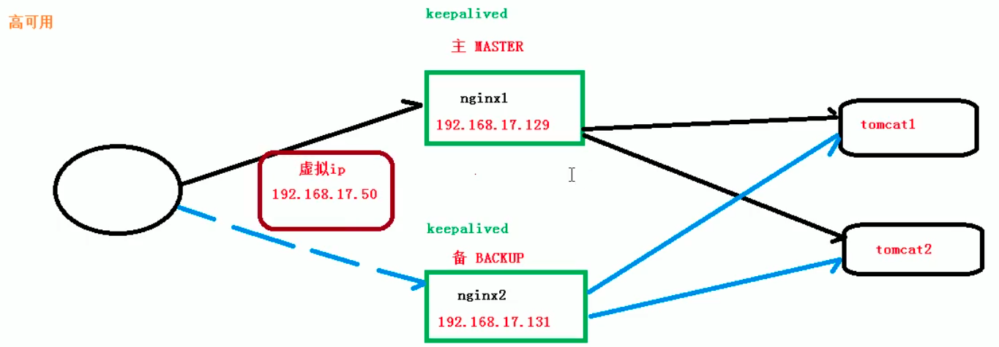
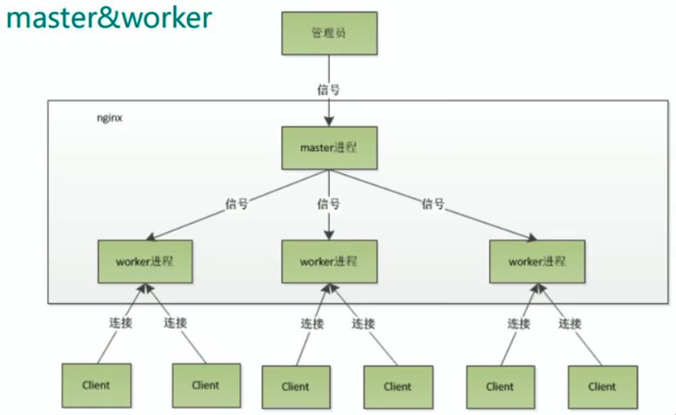
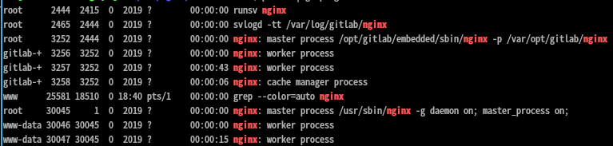
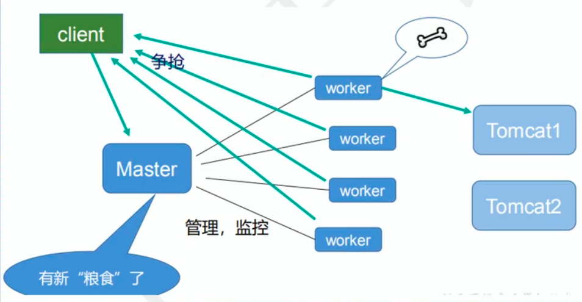

# 一、Nginx基础

## 是什么

高性能HTTP和反向代理Web服务器，由俄罗斯人开发，第一个版本发布于2004年

占用内存小、并发能力强，专门为性能优化而开发，最高支持50000并发连接，与之作为对比的是，apach一旦有200个以上的进程，web响应的速度就会非常慢了。DOS攻击对其无用。

Nginx又是一个基于事件驱动的产品。

支持热部署，可以持续不间断地提供服务。

这里有详细介绍 : https://lnmp.org/nginx.html

## 反向代理

正向代理：代理客户端用户的所有请求，访问目标网站，典型的如科学上网

反向代理：代理服务端被访问，接收客户端请求，由反向代理服务器选择目标服务器，并将结果返回给客户端。对客户端来说，只是暴露了代理服务器。（写博客时加一个图片说明）

## 负载均衡

传统的单个服务器处理所有请求，当请求量过大时，单个服务器无法承受，此时可以多个服务器，构成一个集群，而将所有请求较为均匀地分发到这个集群中的具体服务器上，就叫负载均衡。

负载均衡其实就是在反向代理的基础上增加一个均匀分发的功能。

## 动静分离

传统服务的部署方式，将静态资源如html、css、js和动态资源如servlet等部署在同一台机器上，这样会使得一个页面加载时全都访问该服务器，增大了服务器的访问压力。

动静分离，就是将静态资源分离出来，使服务器只提供动态资源的服务，从而提高服务器的吞吐量。

Nginx处理静态请求，动态请求转发到实际服务器中进行处理

# 二、Nginx使用

## 安装

官网下载安装

安装完成后，查看linux防火墙，因为防火墙很多是没有开放相应端口的。

```bash
// 查看开放的端口号
firewall-cmd --list-all

// 设置开放的端口号
firewall-cmd --add-service=http --permanent
sudo firewall-cmd --add-port=80/tcp --permanent

// 重启防火墙
firewall-cmd --reload
```

## 常用命令

使用nginx操作命令时，需要进入到nginx的二进制目录

```bash
# 查看版本号
./nginx -v
# 关闭nginx
./nginx -s stop
# 启动
./nginx
# 重新加载
./nginx -s reload
```

## nginx配置文件解析

可以找到nginx安装目录下的nginx.conf，很多注释的部分，他们其实就是官方提供的例子

```nginx
# 全局块
user www-data;
worker_processes auto;
pid /run/nginx.pid;
include /etc/nginx/modules-enabled/*.conf;

# events块
events {
        worker_connections 768;
        # multi_accept on;
}

# http块
http {

		# http全局块
        ##
        # Basic Settings
        ##

        sendfile on;
        tcp_nopush on;
        tcp_nodelay on;
        keepalive_timeout 65;
        types_hash_max_size 2048;
        # server_tokens off;

        # server_names_hash_bucket_size 64;
        # server_name_in_redirect off;

        include /etc/nginx/mime.types;
        default_type application/octet-stream;

        ##
        # SSL Settings
        ##

        ssl_protocols TLSv1 TLSv1.1 TLSv1.2; # Dropping SSLv3, ref: POODLE
        ssl_prefer_server_ciphers on;

        ##
        # Logging Settings
        ##

        access_log /var/log/nginx/access.log;
        error_log /var/log/nginx/error.log;

        ##
        # Gzip Settings
        ##

        gzip on;

        # gzip_vary on;
        # gzip_proxied any;
        # gzip_comp_level 6;
        # gzip_buffers 16 8k;
        # gzip_http_version 1.1;
        # gzip_types text/plain text/css application/json application/javascript text/xml application/xml application/xml+rss text/javascript;

        ##
        # Virtual Host Configs
        ##

		# server块，直接通过include的方式包含进来
        include /etc/nginx/conf.d/*.conf;
        include /etc/nginx/sites-enabled/*;
}


#mail {
#       # See sample authentication script at:
#       # http://wiki.nginx.org/ImapAuthenticateWithApachePhpScript
# 
#       # auth_http localhost/auth.php;
#       # pop3_capabilities "TOP" "USER";
#       # imap_capabilities "IMAP4rev1" "UIDPLUS";
# 
#       server {
#               listen     localhost:110;
#               protocol   pop3;
#               proxy      on;
#       }
# 
#       server {
#               listen     localhost:143;
#               protocol   imap;
#               proxy      on;
#       }
#}
```


由三部分组成

1. 全局块

   运行环境相关指令

2. events块

   用户的网络连接相关参数

3. http块

   配置最频繁部分

   - http全局块

     

   - server块

     

# 三、实践

## 反向代理

```nginx
# 全局块
user www-data;
worker_processes auto;
pid /run/nginx.pid;

events {
    worker_connections 768;
}

http {
    sendfile on;
    tcp_nopush on;
    tcp_nodelay on;
    keepalive_timeout 65;
    types_hash_max_size 2048;

    include /etc/nginx/mime.types;
    default_type application/octet-stream;
    
    server {
        listen 80;
        server_name apitest.haowande.com;	# server_name指定了源地址
        
		location /ergedd/ {
            proxy_pass http://127.0.0.1:19898/;
            proxy_set_header Host $host;
            proxy_set_header X-Real-IP $remote_addr;
            proxy_set_header X-Forwarded-For $proxy_add_x_forwarded_for;
        }
    }
}

```

location中路径匹配的几种方式

1. =  用于不包含正则表达式的uri前，匹配成功就立刻处理
2. ~  正则表达式匹配，区分大小写
3. ~*  正则表达式匹配，不区分大小写
4. ^~ 不包含响应的正则表达式匹配

具体参考nginx手册看看

## 负载均衡

```nginx
# 全局块
user www-data;
worker_processes auto;
pid /run/nginx.pid;

events {
    worker_connections 768;
}

http {
    
    sendfile on;
    tcp_nopush on;
    tcp_nodelay on;
    keepalive_timeout 65;
    types_hash_max_size 2048;

    include /etc/nginx/mime.types;
    default_type application/octet-stream;
    
    upstream myserver {
        server 127.0.0.1:19898;
        server 127.0.0.1:19899;
    }
    
    server {
        listen 80;
        server_name apitest.haowande.com;	# server_name指定了源地址
        
		location /ergedd/ {
            proxy_pass http://myserver;
            proxy_set_header Host $host;
            proxy_set_header X-Real-IP $remote_addr;
            proxy_set_header X-Forwarded-For $proxy_add_x_forwarded_for;
        }
    }
}
```

重要的点有两个，一是声明负载均衡集群，即upstream，而是在location的proxy_pass指向声明的负载均衡。

负载均衡策略

- 轮询（默认）
- weight: 即权重，可以为每个服务设置权重，则会按照权重进行分配
- ip_hash: 针对ip做hash，依据结果进行访问
- fair: 按照后端服务器响应时间分配，响应时间短的优先分配

## 动静分离

如下设置静态资源访问路径

```nginx
......
server {
    listen 80;
    server_name apitest.haowande.com;
    
    location /images/ {
        root /data/;
        index index.html index.htm;
        autoindex on;
        expires 3d;
    }
}
......
```

即将前缀为/images/请求映射到nginx所在机器的/data/文件路径下，

如访问 apitest.haowande.com/images/a.html实际访问的是nginx机器上的/data/a.html文件

其中autoindex on选项会在只访问这个目录时通过页面的形式将/data/文件夹下所有文件列举出来。

expires表示同一个资源再次本访问时nginx将不会再返回该资源，而是让浏览器继续使用自身的缓存。

## 高可用

即使nginx宕机了，也要让服务继续可用，这就叫高可用。可启动多台nginx服务器，一台作为主服务器，其它作为备用服务器。主服务器宕机后，切换到备份服务器中。



其原理是主备机运行名为keepalived的软件（因此要先安装keepalived），对外暴露一个虚拟ip，该ip默认绑定到主服务器，主服务器挂掉后绑定到备份服务器。

全程主要就是安装和配置keepalived这个软件。详情参见keepalived官方使用方法。这个原理和kubernetes差不多

# 四、Nginx原理



Nginx启动后，后两类进程，一是master，二是多个worker进程，通过ps -ef | grep nginx也可以查看到，在我们的ci服务器中，有两个nginx启动了，一个gitlab自带的nginx，一个是我们手动启动的nginx。



master管理众多worker，worker用于具体执行任务

 

master-workers优点

- 可以进行热部署，原理是分批更新worker
- 每个worker是独立的进程，不用加锁，且如果某个worker出现问题时，其它worker不会受到影响。

worker数量设置多少合适呢？

Nginx和redis类似，都采用的io多路复用机制，每个worker是独立进程，每个进程内只有一个主线程，通过异步非阻塞的方式处理请求，并发量可以很大。

worker数量和cpu核心数相同是最合适的。

worker_connection是多少？

- 一个客户端请求占用2或4个连接数
- 如果一个worker_connetcion设置为1024，则它支持最大静态连接并发数为1024//2，最大动态连接并发数为1024/4
- 这个计算方式还是存疑的，如有兴趣可以看看手册

关于上面计算方式的解释

在http1.1协议下，浏览器默认使用两个并发连接，因此计算方式是2或4，所以不是协议的问题，而是浏览器的问题？

这里有一篇文章可作参考

https://blog.51cto.com/liuqunying/1420556