# Redis开发与运维 读书笔记

# 目录

这是一本偏运维的书籍，没必要从头到尾完全看，我本次观看的目的在于搞清楚Redis到底是什么东西，以及Redis实现缓存、分布式队列的原理。为此，需要学习的章节如下

- 第1章：初识Redis——详细看
- 第2章：API的理解和使用——简单看
- 第3章：小功能大用处——简单看
- 第4章：客户端——跳过
- 第5章：持久化——简单看
- 第6章：复制——简单看
- 第7章：Redis的噩梦:阻塞——**详细看**
- 第8章：理解内存——**详细看**
- 第9章：哨兵(高可用)——简单看
- 第10章：集群——简单看
- 第11章：缓存设计——**详细看**
- 最后三章：简单看

# 第1章：初始Redis

## 特点

- 能够存储各种各样的值，因此能够满足多种应用场景
- 所有数据放在内存中，因此读写性能惊人
- 数据能够持久化，不会出现一般内存数据库丢失数据的情况
- 功能强大
  - key过期
  - 发布订阅
  - 事务
  - 流水线
  - Lua脚本

### 优点

- 速度快，官方宣称QPS为10万/秒
  - 所有数据放内存
  - C语言实现
  - 单线程架构，预防了多线程竞争
  - 源代码精细打磨，Redis是少有的集性能和优雅于一身的开源代码

- 存储值不仅是字符串，还可以是具体的数据结构，主要提供5中数据结构

  - 字符串
  - 哈希
  - 列表
  - 集合
  - 有序集合

  额外提供三种数据结构

  - 位图
  - HyperLogLog
  - GEO(地理位置定位，Redis3.2开始)

- 丰富的功能
  - key过期功能 —— 可做缓存用
  - 发布-订阅功能 —— 可做消息系统
  - 支持Lua脚本 —— 可自定义Redis命令
  - 简单的事务功能 —— 一定程度上保证事务特性
  - 提供流水线功能 —— 客户端能将一批命令传到Redis，减少网络开箱

- 简单稳定
  
- 加上集群版的源代码也只有5万行左右，开发人员可以吃透它
  
- 持久化
  
  - 提供RDB和AOF两种策略进行数据持久化
- 主从复制
  
- 提供复制功能，是分布式Redis的基础
  
- 高可用和分布式
  - 从2.8开始提供高可用实现 Redis Sentinel，确保节点故障发现和故障自动转移
  - 从3.0开始提供分布式实现 Redis Cluster

### Redis不适合做

- 数据量非常大时，由于Redis存放在内存中，经济成本会非常高
- 冷数据不适合(即不需要经常操作的数据)，将冷数据存储在Redis中是对内存的浪费

### 总结

Redis是一个数据库，其原始作者开发它的目的也是构建一个属于自己的数据库，缓存只是它的一部分比较小的功能，这点千万要记住，不要像是理解Memcached那样去理解它。

## Redis启动

- 启动服务端

  ```bash
  redis-server //直接启动，默认配置
  redis-server --port 3304 启动时指定启动参数
  redis-server /configfile 启动时指定启动配置文件
  ```

  redis目录下有一个redis.conf配置文件，这是它的默认配置文件。

- 启动客户端

  - 交互式

    ```bash
    redis-cli -h 127.0.0.1 -p 6639
    ```

  - 命令式

    命令式能够直接得到要执行的命令的值

    ```bash
    redis-cli -h 127.0.0.1 -p 6639 get key
    ```

- 停止Redis服务

  ```bash
  redis-cli shutdown
  ```

### 注意事项

- redis shutdown是一个过程：断开与客户端的连接 -> 生成持久化文件
- 直接kill进程号会造成持久化失败，缓冲区资源不能及时回收等后果
- shutdown有 save | nosave 参数，用于指定关闭前是否需要生成持久化文件

## Redis的版本

- 奇数版本为开发版
- 偶数版本为正式版
- 这种命名规则参考Linux

- 写这篇笔记时，已经是Redis 6.0版本，而写该书的时间点还是4.0版本，书则是以3.0版本进行介绍。

### 在本书到当前这段时间，Redis主要升级了什么


# 第2章 API的理解和使用

命令介绍不记笔记，需要时自己看书去

## 预备

### 数据结构

Redis的五种数据结构如下

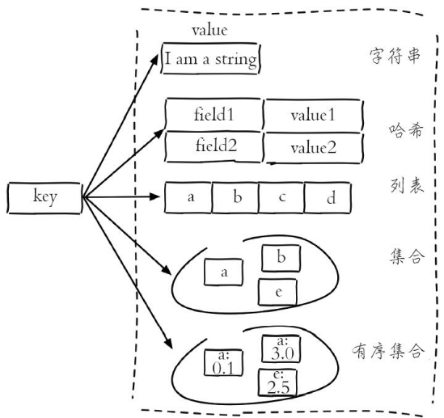

每种数据结构有多种编码

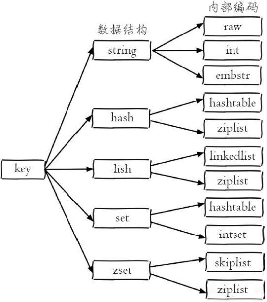

### 单线程模型

所有客户端想Redis服务端发送的命令都会进入队列，服务端在单线程上依次执行。

### Redis快的原因

- 纯内存访问，保证了Redis在服务端本地是快的
- 非阻塞IO，使用epoll作为IO多路复用的技术实现
- 单线程避免了线程切换和竞争产生的消耗

可以看到，后面两个点，是目前主流响应式框架的主流方式。

## 字符串

字符串类型可以存任意类型的字符串(包括JSON，XML等)、数字、二进制。上限为512MB。从上面的string内部编码上也可以看出

### 常用命令

- set
- get
- mset
- mget 节省的网络时间，在服务端命令还是一条一条地执行的
- incr 因为单线程模型，Redis的自增不会使用CAS，因此没有多余的CPU消耗
- decr
- incrby
- decrby
- incrbyfloat
- append 向字符串尾部追加
- strlen 计算字符串字节数
- 。。。。。。

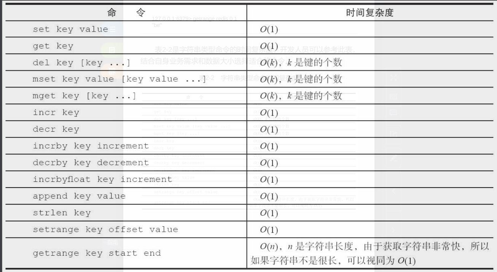

### 内部编码

- int 8字节的长整型
- embstr 小于等于39字节的字符串
- raw 大于39字节的字符串

Redis根据当前值的类型和长度决定使用哪种内部编码

### 查看一个值的内部编码

```bash
object encoding key
```

## 哈希

hash就是一般说的字典、关联数组等

### 命令

- hset
- hget
- hdel
- hlen
- hmget
- hmset
- hexists
- hkeys 获取所有field
- hvals 获取所有value
- hgetall 获取所有field-value
- hincrby 对field中的值自增
- hincbyfloat
- hstrlen 对field的值计算字符串长度

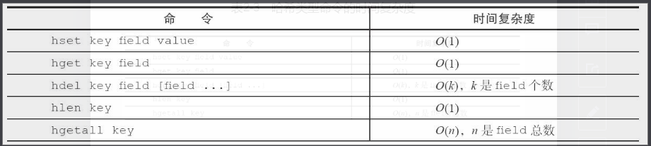

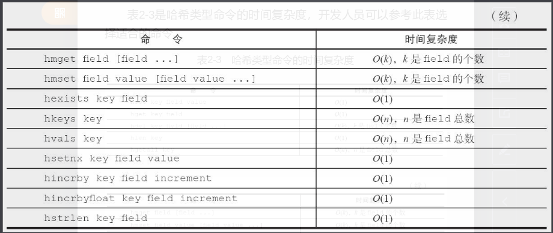

### 内部编码

- ziplist 压缩列表，当哈希类型元素个数小于hash-max-ziplist-entries(默认512)，且所有值都小于hash-max-ziplist-value(默认64字节)时，使用压缩列表，它以更加紧凑的结构实现多个元素连续存储，节省内存
- hashtable 无法满足ziplist条件时，使用hash表，寻址时间复杂度为O(1)

### 应用场景

- 将关系型数据库的一条记录以hash的形式存储到redis中，比直接序列化成字符串存要直观。

## 列表

一个列表最多存放 2^32 - 1 个元素

### 命令

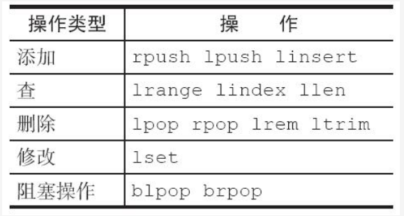

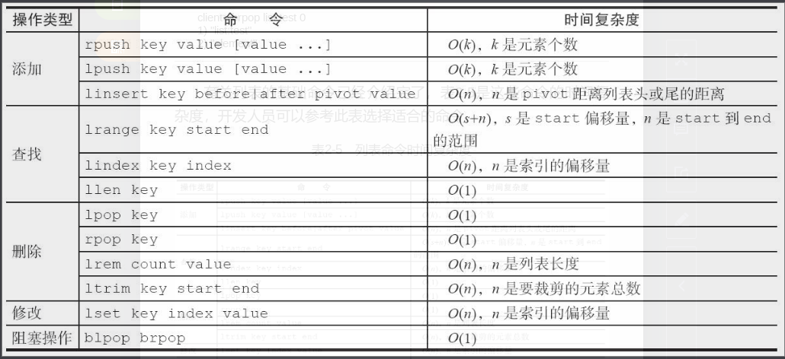

### 内部编码

- ziplist 压缩列表，当列表元素个数小于list-max-ziplist-entries、列表中每个元素小于list-ziplist-value时，redis采用它作为list的内部编码
- linkedlist 链表

### 使用场景

- 消息队列 lpush + brpop 实现消息队列

## 集合

一个集合最多存放 2^32 - 1 个元素

### 命令

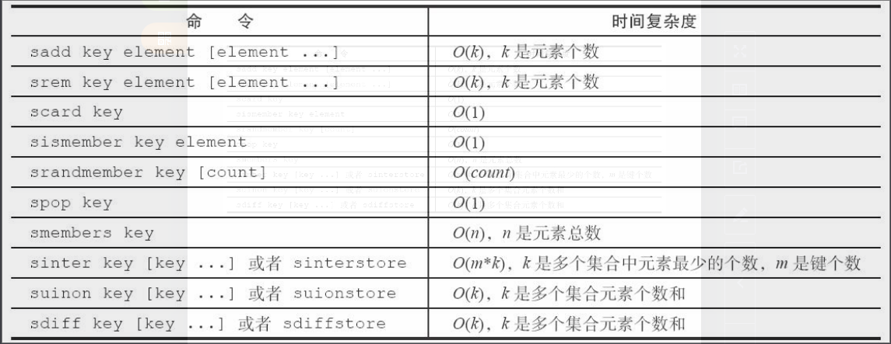

### 内部编码

- intset 整数集合，集合中元素都是整数且个数小于set-max-intset-entries时，使用它，减少内存使用
- hashtable 哈希表

## 有序集合

给每个元素一个score作为排序的依据，有序集合的元素不能重复，但score可以重复

### 命令

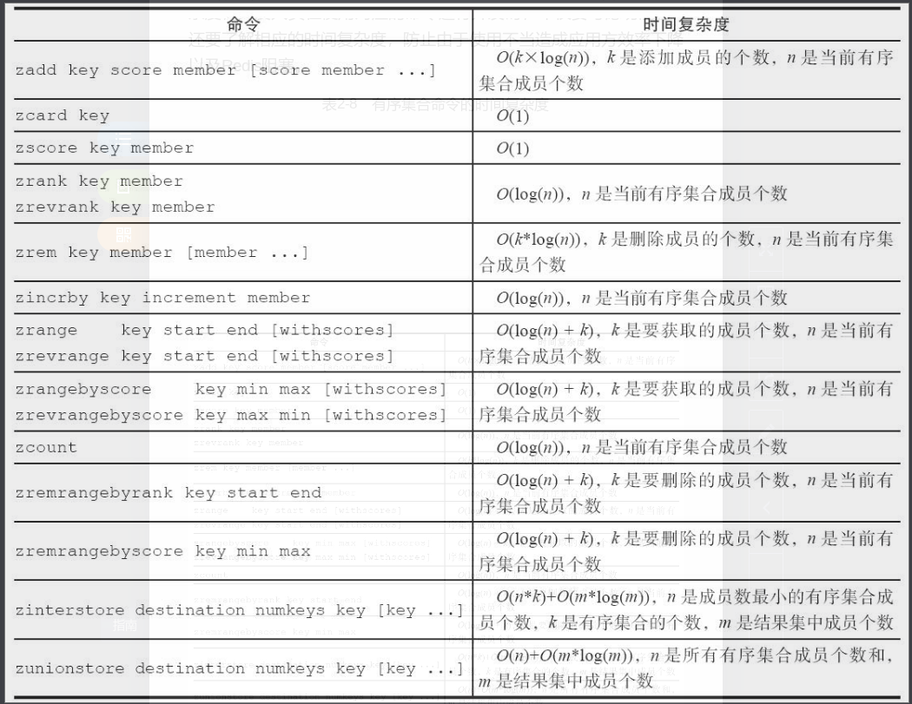

### 内部编码

- ziplist 当元素个数小于zset-max-ziplist-entries配置(默认128个)，每个元素的值小于zset-max-ziplist-value(默认64字节)时，使用ziplist
- skiplist 跳跃表

### 应用场景

- 排行榜，score作为排行依据

## 键管理

可以对键做的事情包括

- 重命名键(重命名键会删除原键，如果值很大，可能会阻塞)

- 随机返回一个键

- 键过期(可设置毫秒级别)

- 迁移键(从一个库迁移到另一个库)

- 遍历键 不建议使用，键过多时很容易阻塞

  ```bash
  keys pattern // pattern有自己的规则
  ```

- 渐进式遍历键

  ```bash
  scan cursor [match pattern] [count number]
  ```

  - cursor 游标
  - match pattern 匹配的规则
  - count number 每次返回的键数量

  scan能够解决keys存在的问题，其时间复杂度为O(1)，redis采用hashtable的结构存储键值对，scan每次只获取一部分键，并返回游标位置，下次传入上次返回的位置，继续获取，直到返回的游标为0表示完成为止。

  scan的缺点：遍历中如有新增键，则可能出现重复遍历或遍历缺失的情况。

## 数据库管理

- 切换数据库

  Redis使用数字标示多个数据库，默认配置一个Redis有16个数据库。数据库之间没有任何关联，甚至可以存储相同的键。

  ```bash
  select 0 // 切换到0号数据库
  ```

  默认使用0号数据库。从3.0开始，已经淡化了多数据库的功能。因为对于单线程的工作模型，多数据库意义不大。完全可以部署多个Redis实例。

- 清除数据库

  ```bash
  flushdb	# 清除当前数据库，类似truncate的操作，要谨慎
  flushall # 清除所有数据库
  ```

## setnx、setxx(分布式锁)

setnx等效set -nx，key必须不存在，用于插入

setxx等效set -xx，key必须存在，用于更新

由于Redis是单线程的，结合setnx和setxx，可以用来做分布式锁。https://redis.io/topics/distlock，看本文档最后的记录。

# 第3章 小功能 大用处

## 慢查询分析

慢查询日志的原理就是卡命令执行前后的时间差，当超过一定阈值时，就将相关信息记录下来。

如下是一个命令的执行生命周期

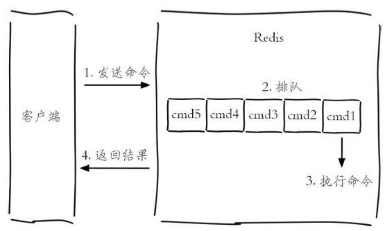

### 配置

- showlog-log-slower-than 指定蛮查询阈值
- showlog-max-len 最多存储多少条慢查询日志。日志存在一个列表中，该参数设置列表长度

### 获取慢查询

- showlog get

## Redis Shell

介绍了Redis命令行工具的一些巧妙用法

## Pipline

问题：上面说过，Redis执行一条命令周期为 客户端发送命令 -> 命令排队 -> 命令执行 -> 服务端返回结果，其中第一步和第四步共同叫做往返时间(RTT)。部分操作如mget提供了一次操作多个key的功能，节省了RTT，但并非所有命令都支持批量操作，对于没有批量操作的命令，还是存在浪费RTT的情况

解决：Pipline，能够将任意命令打包执行，再打包返回，从而节省RTT

### 对比原生批量命令

- 原生批量命令是原子的，而Pipline不是
- 原生批量命令只支持多个key，而Pipline支持多个命令
- 原生批量命令是服务端支持实现的，而Pipline是客户端与服务端共同实现的

## 事务和Lua

支持简单的事务，简单是因为不支持回滚。

## Bitmaps

该数据结构可对位进行操作。

- Bitmaps本身并非一种数据结构，他就是字符串，只不过可以对字符串的位进行操作
- Bitmaps提供单独的一套命令，操作起来不像字符串
- Bitmaps的用处主要是节省存储空间，当业务量级达到千万、亿级时，节省空间相当可观，但在十万这种级别时，就不怎么节省了

## HyperLogLog

- 它也不是一种新的数据结构，实际是字符串，是一种基数算法。
- 它只能用来计算独立总数，比如昨天有uuid-1,uuid-2两个用户访问，今天有uuid-2，uuid-3访问，则通过HyperLogLog可计算独立总数为3。由于它不需要记录每条记录，且采用特殊算法，因此占用空间小得惊人。
- 它存在一定误差率，官方说是0.81%

## 发布-订阅

Redis直接支持发布-订阅模式

- 发布消息

  publish channel message

- 订阅消息

  subscribe channel1 channel2 ...

- 取消订阅

  unsubscribe channel1 channel2 ...

- 还可以查看可订阅的channel、查看某channel订阅数、订阅一批channel等

## GEO

从Redis 3.2开始支持地理位置功能，它是借鉴NoSQL数据库Ardb实现的。

- 工作方式

  录入经度、纬度、位置名称

  提供计算两个位置的距离、获取某位置指定距离范围内的其它位置等方便的计算。

# 第5章 持久化

## RDB方案

RDB保存当前数据库快照，有save和bgsave两个方案可选，前者阻塞当前线程，后者会fork新的进程进行处理。

### 优点

- 保存的是紧凑压缩的二进制文件，代表某个时间点上的数据备份。适用于全量备份，复制等场景。
- 二进制文件恢复速度远快于AOF方式

### 缺点

- fork子进程是重量级操作，因此不能做到实时持久化
- 保存二进制文件，可能老版本的Redis服务无法兼容新版本的备份数据

## AOF方案

Append only file。以独立日志的方式记录每次的写命令，重启时再重新执行AOF文件达到恢复数据的目的。

AOF解决了RDB无法实时持久化的问题，是目前的主流持久化方式

### 文件格式

AOF采用文本协议格式存储每次的写命令。这样做的好处是兼容性绝佳。

## 重启时加载备份文件

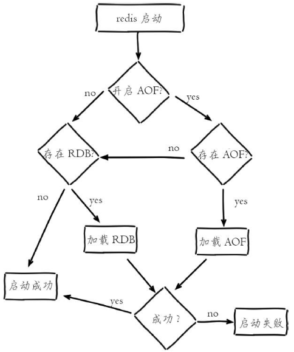

# 第6章 复制

在分布式系统中为了解决单点问题通常都会把数据复制多个副本部署到其它机器。满足故障恢复和负载均衡等需求。

## 配置

Redis的复制是单向的，只能由主节点复制到从节点。可以通过命令slaveof建立主从复制关系。也可以通过slaveof no one声明当前节点也是主节点，从而断开与其它主节点的复制关系。

### 从节点只读

默认情况下，从节点都是只读的，因为复制是单向的，在从节点的写操作无法复制到主节点上，会造成数据不一致。

### 传输延迟

复制需要传输，会有网络延迟，Redis提供两种传输方式

- 无延迟，即主节点有任何修改都会立马传输到从节点，适用于网络环境好的场景
- 有延迟，主节点会合并较小的数据包，从而节省带宽。

## 主从拓扑

一般有三种拓扑结构

- 一主一从
- 一主多从 要避免复制风暴
- 树桩结构

## 原理

### 建立主从关系

一切从执行slaveof讲起，执行后主从关系建立步骤如下

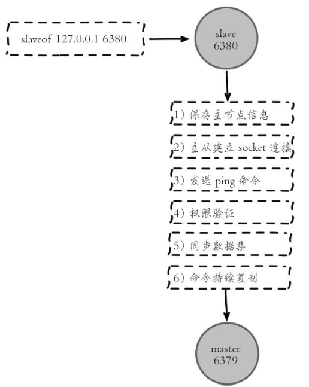

### 数据同步

- 全量复制

  一般为初次复制场景，一次性全部发给从库

- 部分复制

  部分复制，用于复制中因网络闪断等原因造成的数据丢失，在主从重新建立连接后补发确实的信息。

  部分复制是对全量复制的一种优化。

psync启动复制，由于初次复制之后的是部分复制，它需要如下三个组件支持

- 复制偏移量

  主节点记录发送的数据偏移量，从节点记录接收的偏移量，每秒上报（因此主节点知道从节点的偏移量），通过对比偏移量，可以判定主从节点是否一致

- 复制积压缓冲区

  主节点上的一个队列，在从节点创建时一并创建，从此在主节点每次执行写命令时，除了将其发送给从节点，还会写入该队列。由于队列的先进先出特性，因此可以存储最近的写命令

- 主节点运行ID

  是Redis启动后分配的ID，用于唯一标示主节点，使得从节点可以区分是从哪个主节点复制的数据。ip+port的方式不一定能够区分

### 心跳机制

主从节点建立主从关系后，需要定期相互发送心跳请求维持连接关系。

# 第8章 理解内存

使用info memory命令可以查看内存使用状态。内存消耗总计有如下几点

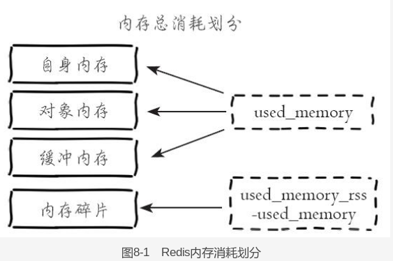

- 对象内存

  即用户的存储数据

- 缓冲内存

  包括客户端缓冲、复制积压缓冲区、AOF缓冲区；

  客户端缓冲主要指

  - 客户端连接缓存，几个连接不打紧，连接多了占用内存就可观了。可以限制最大连接数。
    - 订阅客户端，使用发布-订阅功能时，对客户端有单独的缓冲区，当生产速度快于消费速度时，缓冲区占用就会上升

- 内存碎片

  和Redis使用的内存分配器有关系。优化的方式是数据对齐和安全重启。

## 内存回收策略

### 删除过期的键策略

#### 惰性删除

即不主动删除带有超时属性的键，而是在客户端请求该键时，检查到该键已过期，删除并返回空。这样能够节省CPU，但是可能造成内存泄露，于是有了定时任务删除作为补充

#### 定时任务删除

Redis维护了一个定时任务，一般每秒执行10次，可配。该定时任务对过期键的删除逻辑采用自适应算法。实际如下

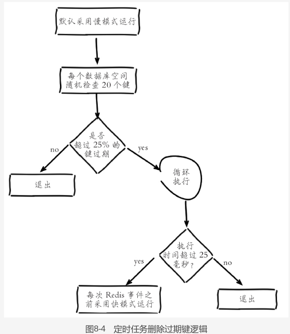

慢模式和快模式算法一致，只是超时时间不同。


### 内存溢出控制策略

即当内存达到配置的最大内存时执行的策略，总计有六种

- 默认策略：不删除任何数据，但是会拒绝所有写入操作并返回错误信息
- volatile-lru：根据LRU算法删除设置了超时属性的键，直到腾出足够的空间为止
- allkey-lru：根据LRU算法删除键，不管它有没有设置超时属性，直到腾出足够的空间为止
- allkeys-random：随机删除所有键，直到腾出足够的空间为止
- volatile-random：随机删除过期键，直到腾出足够的空间为止
- volatile-ttl：根据键的ttl属性，删除最近将要过期的数据，如果没有，则回退到默认模式。

注意，如果Redis频繁执行内存溢出控制，会影响到性能。

## 内存优化

Redis存储的所有值对象，在内部定义为redisObject结构体，内部结构如图。

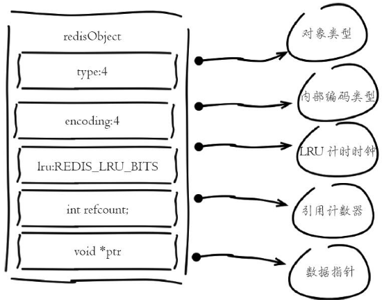

其中lru字段记录了键最后一次被访问的时间。refcount用于记录对象被引用次数，用于引用计数回收内存。

### 策略1：缩减键值对象

即缩减key和value的长度。当键越短越好（当然还是要保证能看懂），值较复杂时候序列为二进制存储，此时高效的序列化工具能够得到更小的序列化结果。

### 策略2：共享对象池

Redis内部维护了0-9999的整数对象池，因为创建一个Redis对象最少要占用16个字节，超过了整数本身的大小，当这样的整数过多时，就造成浪费。于是就有了整数对象池。适用范围包括整数值对象，也包括list、set等复杂类型的内部元素。因此，开发中在满足需求的前提下，尽可能多用整数对象。

但是由于LRU算法依据的访问标志存储在对象上，因此使用共享对象池时依据LRU算法并不会回收使用共享对象的键，这点要注意。

只有整数共享对象池的原因有以下几点

- 整数使用几率大
- 对象池的关键动作，判断相等性，整数对象判断相等性的时间复杂度为O(1)，字符串为O(n)，复杂类型更麻烦

### 策略3：字符串优化


### 策略4：编码优化

Redis每种类型都有两种以上编码方式，即两种以上内部存储数据结构。这是为了实现效率和空间的平衡。尽可能使用紧凑的编码类型，也是优化内存的一种方式。

### 策略5：控制键的数量

Redis本质是一个数据结构服务器，为我们提供了多种数据结构。在使用Redis时不要完全把它当做Memcached使用，即不要创建大量的key，然后用get和set去操作，大量key也会占用很多内存。

要合理利用Redis的数据结构，可以将某些键放到数据结构中，从而减少需要的key数量。

# 第7章 Redis的噩梦：阻塞

Redis是单线程架构，一旦阻塞，哪怕时间很短，都将是噩梦

## 内在原因

- API或数据结构使用不合理，如对有上万个元素的hash结构执行hgetall操作

  优化策略

  - 禁用keys、sort等命令
  - hgetall改为hmget等
  - 将大对象拆分为多个小对象，防止一次取过多数据

  **对于慢查询和大对象，redis有专门的命令获取**

- CPU饱和

  指Redis线程将一个CPU核心占满的情况，可以使用redis-cli --stat查看当前吞吐量。如果真的饱和则需要做集群化水平扩展来分摊OPS压力。

- 持久化阻塞

  持久化导致的阻塞，要看请参考书

## 外在原因

- CPU竞争

  Redis是典型的CPU密集型应用，不建议和其它CPU密集型应用部署在一起，以免压缩Redis的CPU资源

- 内存交换

  操作系统有一个内存swap设置，会将一部分内存数据换出到硬盘，如果Redis被交换过去，将会导致卡顿。

  常见优化操作为保证机器有足够的可用内存；确保所有Redis实例设置最大内存占用，以免无止境增长。

- 网络问题

  网络闪段、Redis连接达到最大而拒绝连接等。

# 第9章 哨兵(Redis sentinel)

Redis Sentinel是Redis的高可用实现方案

## 为什么要有哨兵

主从节点的优点在于分散主数据库的读压力，同时当主数据库崩掉时也能将从库升级为主库进行服务。

主从节点的缺点在于

- 主节点故障时，需要手动将从节点升级为主节点。
- 写还是在主节点进行，因此写能力和存储能力受到单机限制

第一个缺点是高可用问题，第二个缺点是分布式问题，分别使用哨兵和集群进行解决。这就是本章哨兵存在的意义。

## 哨兵能干什么

当主节点出现故障时，哨兵能够自动完成故障发现和故障转移，并通知应用方，实现真正的高可用。

Sentinel相比主从节点只是多了若干Sentinel节点，并没有对原主从节点进行什么改造。

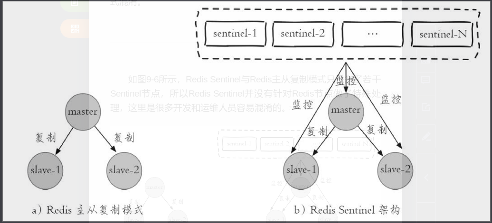

## 哨兵工作原理

1. 加入一个一主两从的结构中主节点发生故障

2. 每个Sentinel节点通过定期监控每个节点，发现了主节点故障

3. 多个Sentinel节点对主节点的判断达成一致，选举出一个Sentinel节点作为领导者负责故障转移

   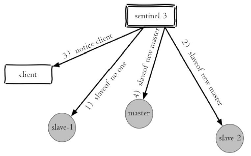

   转移后结构如下

   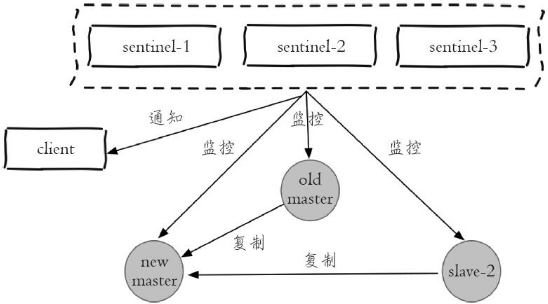

可以看到，Redis Sentinel有一下几个作用

- 监控：定期监控Redis数据节点、其余Sentinel节点是否可达
- 主节点故障转移：实现主节点的重新设置
- 通知：能够将故障转移的结果通知应用方
- 配置提供者：Redis Sentinel结构中，客户端在初始化时连接的是Sentinel节点集合，从中获取主节点信息。

# 第10章 集群

前面说了，主从复制结构有两个缺点，其中高可用由Redis Sentinel解决，分布式问题就由集群解决了。

## 数据分布

### 数据分布理论

常见的数据分区方式有两种

- hash分区
- 顺序分区

二者特点如下

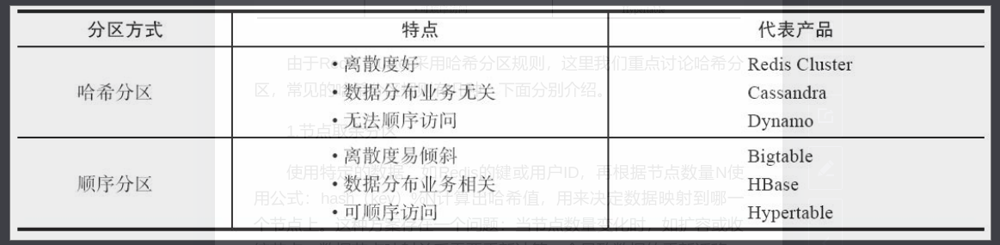

Redis集群采用哈希分区规则。哈希分区由有一下几种

- 节点取余分区

  使用公式 hash(key)%N 计算要分区到哪个节点，N是节点数量。该方案的缺点在于当节点变化时，数据节点映射关系要重新计算。优点在于简单，常用于数据库的分库分表。

- 一致性哈希分区

  为系统中每个节点分配一个token，这些token构成一个哈希环，执行节点查找操作时，先根据key计算哈希值，然后顺时针找到第一个大于等于该哈希值的token节点。

  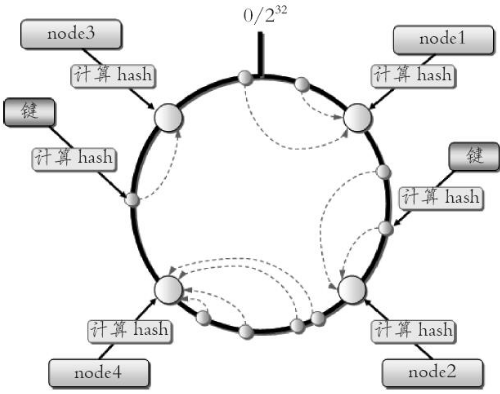

  这样的优点：增删节点只影响哈希缓中相邻的节点，对其它节点无影响

  这样的缺点：

  - 加减节点会造成哈希环中部分数据无法命中，需要手动处理。因此它常用于缓存场景
  - 节点较少时，比如两个，节点变化会影响全部两个节点数据分布，因此不适合少量节点的方案

- 虚拟槽分区

  使用分散度良好的哈希函数把所有数据映射到一个固定范围的整数集合中，这些整数被定义为槽。这些整数的范围远远大于节点数。使得一个节点负责多个槽，槽是数据管理和迁移的基本单位。

  采用大范围槽主要目的是方便数据的拆分和集群扩展。当新增或者删除一个节点时只需要迁移部分槽的数据。

Redis使用虚拟槽分区的特点

- 解耦了数据和节点之间的关系，简化增删节点的难度
- 节点自身维护槽的映射关系，不需要客户端或代理服务器维护
- 支持节点、槽、键之间的映射查询。

## 集群功能的限制

- 批量操作：仅支持同slot值的key执行批量操作，不同slot值的mget、mset目前还不被支持
- 事务：仅支持多key在同一节点上的事务操作，不支持在不同节点的key的事务操作
- key是数据分区的最小粒度，不能将一个大的数据映射到不同的节点
- 不支持多数据库空间，即集群模式下只能使用db0这个数据库空间(当然这点无关紧要)
- 复制结构只有一层：不支持树状主从复制结构


# 第11章 缓存设计

## 缓存更新策略

缓存有生命周期，需要在指定时间后被删除或被更新。

- LRU、LFU、FIFO算法剔除

  用于当缓存满时对数据进行剔除

  由于在数据库没满时缓存数据一致不变，因此一致性最差

  维护成本较低

- 超时剔除

  到期自动删除

  超时前一致性不好，维护成本较低

- 主动更新

  开发人员主动更新，一致性好，但维护成本很高。

**建议的方式**

- 低一致性要求的业务配置使用最大内存和算法剔除策略
- 高一致性结合主动更新+超时剔除

## 穿透优化

### 定义

缓存穿透：查询一个根本不存在的数据，会一直向数据库查询，导致缓存没有起到拦截流量保护后端的作用。

### 优化策略

- 缓存空对象

  数据库查询不到时，构建一个空对象，存入缓存，下次直接命中缓存。

  缺点：

  - 会存储更多的键，需要更多内存空间，如果是攻击，可能导致空间很快满。解决办法是对空对象设置较短的超时时间
  - 存在一段时间不一致，如果缓存空对象期间数据库已经插入了数据，则这段时间在缓存中是没有的

- 布隆过滤器拦截

  在访问缓存前先用布隆过滤器拦截，布隆过滤器能够准确判断可能存在和肯定不存在，只有肯定不存在时才访问缓存和数据库。

  可以利用Redis的Bitmaps实现布隆过滤器(github上有实现)

- 二者对比

  缓存空对象代码维护简单，但会导致数据不一致和过多的缓存空间

  布隆过滤器代码相对复杂，但可以解决缓存空间占用高的问题

## 无底洞优化

### 定义

增加缓存服务节点，但性能不但没有好转，反而下降，称为无底洞现象(投入越多产出不一定越多)。

原因：缓存数据库的键值hash与业务无关，可能将同一个业务需要的数据hash到多个水平扩展的节点，造成每次读取时都会有多次网络IO操作(最优情况只需要一次网络IO)，造成性能的下降。

### 优化策略

- 串行命令

  常规显示，这种方式谈不上优化，即一次获取一个key，复杂度为n次网络+n次命令执行时间。

  该方法唯一好处是实现简单

- 串行IO

  对key计算slot值，根据slot值和节点的对象关系，将key分为多个组，每个组采用pipline或mget，复杂度为node次网络+n次命令执行时间。

- 并行IO

  将串行IO方案的每个组采用多线程的方式请求，使得网络时间并行

- hash_tag

  Redis集群功能有hash_tag功能，可以将多个key强制分配到一个节点上，这样其时间复杂度为1次网络命令+n次命令时间

## 雪崩优化

### 定义

如果由于某些原因缓存层不能提供服务，导致所有请求都会到达存储层，造成存储层跟随宕机，这叫做雪崩

### 优化策略

- 保证缓存层服务高可用

  使用Redis Sentinel和Redis Cluster功能，即使节点挂掉了整个服务也不会挂

- 组件隔离+后端降级

  这是方案级别的优化了

  将每个资源隔离，使用不同的线程池。对于挂掉的服务，将数据降级，比如如果推荐数据缓存挂掉了，可以降级为一般数据。

  资源隔离，可以使用依赖隔离工具Hystrix

## 热点key重建优化

### 定义

使用缓存+过期时间的策略时，当缓存过期且缓存重建需要大量时间时，如果该key是热点key，则该窗口期大量请求会直接打到数据库，可能造成数据库崩溃。

### 优化策略

- 互斥锁

  只允许一个线程重建缓存，其它线程等待缓存重建完成后再重新从缓存中获取数据即可

  使用redis的mutex key

  该方法的风险是如果重建时间过长可能导致思索

- 永不过期

  设置缓存上永不过期，但在功能代码中定期使用单线程刷新该热点key。

  缺点是重建期间多个请求的数据可能不一致

# 需要额外弄清楚的问题

## Redis分布式锁实现原理

Redis官方提供了一种基于Redis实现的分布式管理器——Redlock。针对各个语言都有实现，Java对应Redisson

https://redis.io/topics/distlock

## Redis线程模型

《Redis设计与实现》

## Redis订阅发布实现原理

《Redis设计与实现》

## 学习了解Memcached


## Memcached和Redis区别？

