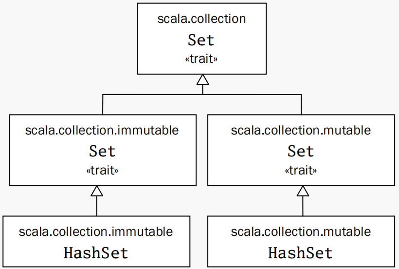
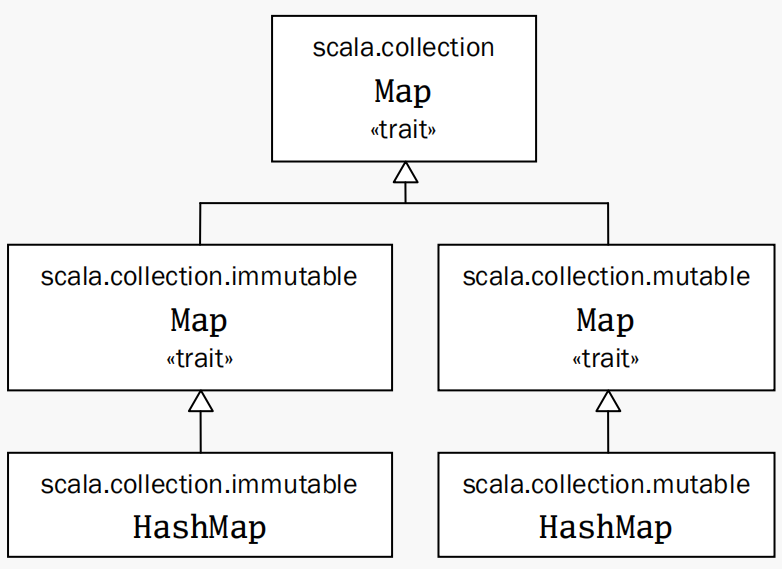
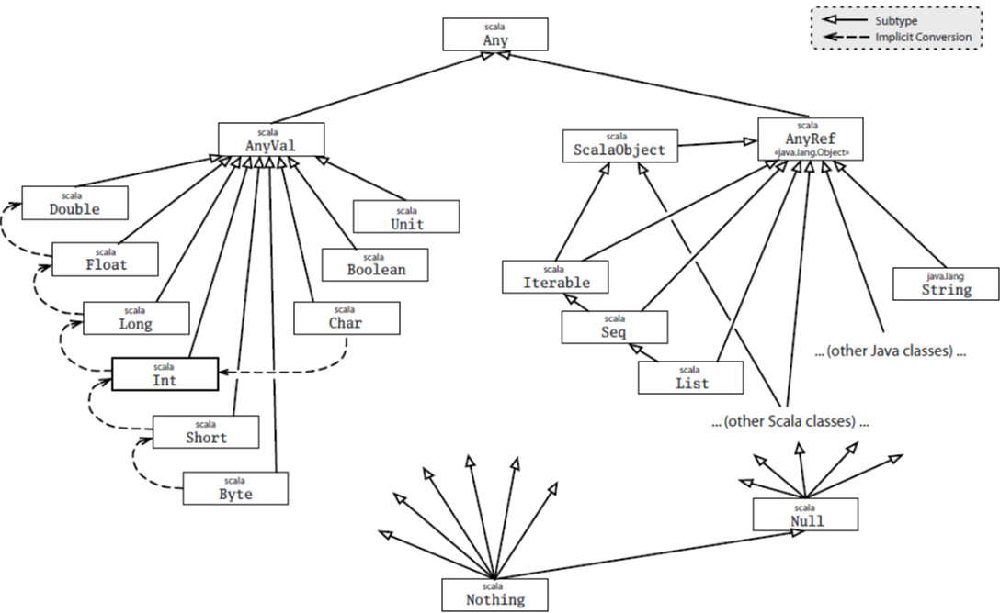
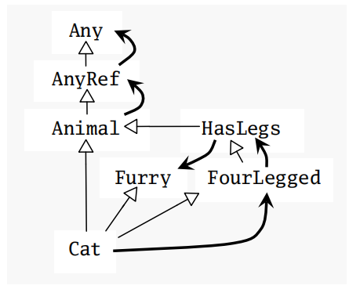
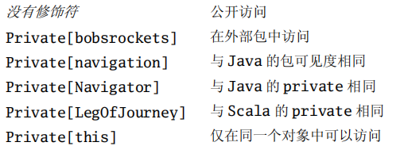

# Scala学习笔记

## 热身

来源于Scala官网提供的[热身训练](https://docs.scala-lang.org/overviews/scala-book/prelude-taste-of-scala.html)，专供Java程序员使用。

### 变量

变量声明也分为val和var，和Kotlin一样，语法也一样。

### 控制语句

- if else，一样

- 匹配语句不一样，这里的匹配语句无比强大

  使用 match case => 这样的方式

  没有else，else就是 case _ => ...

  ```scala
  def getClassAsString(x: Any):String = x match {
      case s: String => s + " is a String"
      case i: Int => "Int"
      case f: Float => "Float"
      case l: List[_] => "List"
      case p: Person => "Person"
      case _ => "Unknown"
  }
  ```

- try-catch

  ```scala
  try {
      writeToFile(text)
  } catch {
      case fnfe: FileNotFoundException => println(fnfe)
      case ioe: IOException => println(ioe)
  }
  ```


# 《Scala编程》学习笔记

## 基础介绍

- 面向对象编程 + 函数式编程 + 静态 + JVM = Scala

- 向Scala中加入自定义内容时，看起来就像是Scala内建的一样，体现了延展性

- Sacala能够如此具有伸缩性，是因为将面向对象和函数式结合了起来

  - 面向对象

    很多语言的面向对象其实不仅仅包含了对象，还包含了注入原生类型、运算符之类的不属于任何对象的内容，这会使编程变得很复杂，限制了伸缩性。

    而Scala的面向对象很纯粹，每个值都是对象，每个操作都是方法调用，没有多余的东西。

  - 函数式

    函数式两个理念：函数是一等公民；函数不应产生副作用。

- Scala也能够与Java完全互操作。几乎所有Scala库都极度依赖Java库。比如类型Int对应的是Java的int类型，异常是java.lang.Throwable的实现类

- Scala优点总结

  - 兼容Java
  - 语法简洁
  - 抽象层级高
  - 静态类型，且类型推断做得很好

- Sacala怎么提现伸缩性

  小到可以写简短的脚本代码；达到可以写庞大的系统

  - 脚本：不经过编译，直接使用scala解释器执行，因此甚至一句代码都可以直接执行
  - 系统：需经过编译，必须遵从面向对象，不能直接执一行裸代码

# 基础的点

- Scala将索引放在括号中，而不是其它语言的方括号中
- scala将集合区分为可变和不可变两种类型，目的是让不可变应用于函数式、可变应用于一般的命令式。因此我们使用时应该注意

## List

List本身及其元素都是不可变的

一些常用的方法

- List() 或Nil，都代表空List

- ::: 叠加两个List，取并集

- :: 在列表前新增一个元素

  ```scala
  // 在空List的基础上，增加3 2 1。
  1 :: 2 :: 3 :: Nil
  ```

  :: 也是方法，不过它的主语在右边，比如上面等价于 `Nil.::(3).::(2).::(1)`

## Tuple

Tuple本身及其元素都是不可变的，但可同时存储多种类型数据。

且它们可在编译期判定元素类型，访问方法从_1, _2这样开始，因为对于拥有静态元组的其他语言如Haskell，都是从1开始的

scala目前最长支持到Tuple22

## Set和Map

Set和Map都只是trait，其实现类有可变和不可变两个分支。





- Map初始化时，使用->方法，该方法对所有对象都有。

- 允许我们对任何对象调用-> 的机制称为隐式转换

  ```scala
  val romanNumeral = Map(1->2, 2->3)
  ```

## 向函数式风格推进

- 最关键的点就是不要使用任何var编程
- scala鼓励函数式编程的一个原因，是可以写出更为简洁的代码，方便维护，方便测试，且不容易犯错
- 另一个关键点就是尽量去除副作用，或是将副作用限制在很小的范围内

# 类和对象

- public是scala的缺省访问级别

## 方法

- 与kotlin不同的是，scala方法的不必加return，直接将最后一行的结果作为结果

- scala推荐的定义方法的风格

  - 避免显式地使用return返回的方法定义
  - 避免有多个返回语句的方法定义
  - 鼓励将方法分解为多个小的方法，将方法当做创建返回值的表达式

- 如果方法不声明返回值，那么即使方法体有返回值，那它的返回值也是Unit

  ```scala
  def g() {"Hello World!!"}
  ```

## 分号

- 句末不用加分号

- 多行语句合并在一行时，之间要加分号

分号推断规则：除非以下的一种情况成立，否则行尾被认为是一个分号

- 行由一个非合法结尾字结尾，如中缀操作符
- 下一行的开始不能作为语句的开始
- 行结束语括号或方括号内部

## 单例对象

- Java不够面向对象，因为它有静态成员

- scala没有静态成员，类似功能由单例对象完成

  ```scala
  object Hello {
      . . . . . .
  }
  ```

- 单例对象可以单独定义，也可以定义成某个类统一名称，此时该单利对象叫做伴生对象；相应地，同名类称为单例对象的伴生类

- 单例对象会在第一次访问的时候初始化

- 没有伴生类的单例对象称为孤立对象，孤立对象常用的使用场景

  - 把相关的功能方法搜集在一起
  - 定义一个Scala应用的入口点

## Scala程序

- 要执行scala程序，必须提供一个有main方法的孤立单例对象
- scala隐式地引用了如下包，如println方法就是来自Predef包下的
  - java.lang
  - scala
  - Predef

- Scala的文件名和类名没有关系，但为了方便，还是建议和Java保持一样的风格
- scala文件可以被当做脚本执行，或者当做源码编译。
  - 文件以表达式结束的会被当做脚本执行
  - 文件以定义结束的当做源码编译
- scalac编译很慢是由于每次都重新扫描包。可以使用fsc命令，它启动一个后台服务，保存上次的编译结果，修改代码再编译时可以省略一些步骤，达到快速编译的效果

## Application特质

- 执行scala程序的另一个方法是实现Application特质
- 实现后，在鼓励对象中直接写想要执行的代码即可
- 这种方式有局限性，因此除非场景很简单，不推荐使用

# 基本类型和操作

- 基本类型和Java完全一样，只是开头大写，并且是来自scala包
- String类型直接使用了java.lang.String

## 文本

- 字符串文本支持原始字串，即`""" lalala """`

- 符号文本

  写成`'<标识符>`的形式，会被映射成scala.Symbol的实例

  ```scala
  # 如下两个等效
  'hello
  Symbol("hello")
  ```

  不过，前面那种方式已废弃了，推荐使用后者

## 操作符和方法

- 所有的操作符都是作用在普通方法调用上的华丽语法

- 不像kotlin必须使用operator、infix之类的声明关键字才能将一个方法声明为操作符，scala将所有方法都可以当做操作符

- 下面展示几种调用方式和等效方法调用

  ```scala
  # 中缀等效
  1 + 1
  1.+(1)
  # 前缀等效
  -1
  1.unary_-()
  # 后缀等效
  "" toLowerCase
  "".toLowerCase()
  ```

  前缀需要说一下，并不是所有方法都可以被当做前缀的，只有+ - ! ~四个才行

## 对象相等性

scala不像java，==比较的是值的相等性，无论是基本类型还是引用类型

## 富包装器

对于每个基本类型，scala都提供一个富包装类型，以提供功能更多的很多隐式方法。

Int对应的富包装器位置为scala.runtime.RichInt

# 函数式对象

- 类参数

  如下a和b被称为类参数，Scala编译器会收集这两个类参数并创建带有这两个参数的主构造器

  ```scala
  class Rational(n: Int, d: Int)
  ```

- Scala编译器将把类内部的非字段、非方法的代码段编译进主构造器，因此这些代码段会在类创建时执行

## 标识符约定

- 字母数字标识符

  - scala和java一样，对于一般变量遵循驼峰命名法。
  - 变量名最好不要包含$和__，因为可能和系统变量名冲突
  - magic number最好不要用多了
  - scala常量用const修饰，命名规则为首字母大写的驼峰命名法。如XOffset。Java的全大写也可以使用

- 操作符标识符

  - 由一个或多个操作符字符组成。即 + - * ?之类的

  - Scala编译后，会将操作符标示转换为合法的带有$的Java标识符

    举例。 :-> 将被转换为 \$colon\$minus\$greater

- 混合标识符

  - 由字母数字加上一个下划线加一个操作符标识符

    如 unary_+，被定义为一元加操作符的方法名

- 文本标识符

  - 用反引号包起来的任意字串

## 隐式转换

可以通过定义如下方法完成Int在合适的时候自动转换为Rational操作

```scala
implicit def intToRational(x: Int) = new Rational(x)
```

这个方法很强大，不过不要乱用。且Int能不能被隐式转换，还要看是否符合方法定义的作用域。

隐式转换代表了不容易被看出，因此除非很显而易见，不然别用它。

# 控制结构

scala仅存在一下几个内建的控制结构，并且所有控制结构都会产生一个值。

- if else

- while 返回Unit，这个返回值并没有什么意义。

- for

  for的下面这种语法被称为发生器语法

  for能够解析任何种类的集合类，包括集合，range等都有效

  ```scala
  for (item <- items)
    print(item)
  ```

  for还可以加if，变成具有过滤器功能的结构

  ```scala
  for (item ，<- items if item.size > 0)
    print(item)
  ```

  过滤器可以包含很多个，而不只是一个

  ```scala
  for (
  	item <- items
      if item.size > 0;
      if item.name == ''
  )
    print(item)
  ```

  一个for中还可以加入多个<-子句，从而得到嵌套循环。

  ```scala
  // items是外层循环，names是内层循环
  for {
  	item <- items
      if item.size > 0
      name <- names
  }
    print(item + " " + name)
  ```

  还可以同时进行变量绑定

  ```scala
  for {
    item <- items
    name = item.name
  }
    print(name)
  ```

  还可以将循环之后的结果创建一个新的集合 即 for yield

  ```scala
  // 将items中元素的名字拿出来，加上hello，创建一个新的数组
  def names = 
  for {
      item <- items
      name = item.name
  } yield {
      name + "hello"
  }
  ```

- try catch

  用法和java完全一样，不同的是

  - catch块支持模式匹配

- match

  模式匹配

  可以匹配的类型是任意的，非常强大。

  每个case语句默认包含了break的功能。因此不想java那样需要break。

- 函数调用

  当一个函数是尾递归时，scala编译器会自动将其编译成循环的形式

- 变量范围

  和Java一样，除了一点

  - scala可以在嵌套块中定义和外层名称重复的变量。

# 函数和闭包

- 作为一个对象的成员的函数，叫做方法
- 本地函数：定义在函数中的函数，很有用

## 偏应用函数

英文名为 partially applied function，这里的偏，是部分的意思。即被部分应用的函数。说得更明白一点，就是部分参数被固定住，当然，这个“部分”可以是0， 于是有了下面第一二个例子。第三个例子能够更形象地展示。

```scala
def sum(a: Int, b: Int, c: Int): Int = a + b + c

// 下面三种都属于偏应用函数
// a为有三个Int参数并返回Int的函数
val a = sum _
// 同上
val a = sum(_)
// a为有一个Int参数并返回Int的函数
val a = sum(1, _, 2)
```

偏函数的原理

​	执行`a=sum _`时，scala编译器会创建一个类，该类存在一个apply方法，该方法的参数为sum同样的参数类型和数量，apply方法内部调用了sum方法。因此，执行'`a(1,2,3)`时其实相当于调用了创建类的`apply(1,2,3)`方法，而该方法调用了`sum(1,2,3)`

## 闭包

闭包名称的来源

- 不带外部变量的函数，叫做closed term

  ```scala
  val addMore = (x: Int) => x + 1
  ```

- 带外部变量的函数，即会使用到外部变量的函数，叫做open term

  ```scala
  val more = 1
  val addMore = (x: Int) => x + more
  ```

- 一个open term在定义时是开放的，但在执行到这个函数时，more将被捕获，函数封闭，得到运算值。这个过程被称为闭包，我们也把这个open term叫做一个闭包，即closure。

- 闭包只有在运行时会捕获外部变量，并且对外部变量的修改在闭包外部也是可见的。因为scala操作的是该自由变量的引用，该自由变量是存在于堆中，而不是栈中（如果是栈中，闭包是一个方法调用，调用完成后对自由变量的修改是不会保存的）

## 变长参数

在参数末尾加上*表示可变参数，它实际上是Array类型。

在Array类型末尾加上*可以让编译器把数组中的每个元素当做参数

```scala
val a = (args: String*) => args.foreach(println)
a(Array("1", "2")*)
```

## 尾递归

- 尾递归就是一个动作调用自己，就称之为尾递归

- scala尾递归优化是自动打开的。

- 可以手动关闭：加参数 `-g: notailcalls`

- scala尾递归有局限性，只能优化直接形式的尾递归。不能优化间接形式，甚至在最后一步调用自身函数的别名都不行。

# 抽象控制

## curry化

是一种函数式编程技巧，将多个参数的函数编程只含有一个参数的多级函数（高阶函数）

```scala
def sum(x: Int, y: Int): Int = x + y
// 柯理化结果如下
def sum(x:Int)(y:Int) = x + y
```

解释：传入第一个参数x会产生一个(Int) => Int函数，再传入第二个参数，能够得到最终结果。

- 当一个函数只有一个参数时，对函数的调用可以用{}替换()。这样的好处是能够自定义结构，结合柯理化，更加能够发挥它的威力

## by-name参数

与by-value（传值参数）参数对应，传值参数会在传入前计算值，而by-name（传名参数）参数是在方法调用后再计算的。其原理是将传入的内容包装成不带参数匿名函数。

传值参数、传名参数、传函数的参数，写法和使用上有如下区别

```scala
// by value参数
scala> def test(param: Int) = println(param)
test: (param: Int)Unit

scala> test(1 + 1)
2
// by-name参数
scala> def test(param: => Int) = println(param)
test: (param: => Int)Unit

scala> test(1 + 1)
2

// 传入函数
scala> def test(param: () => Int) = println(param())
test: (param: () => Int)Unit

scala> test(() => 1+1)
2
```

可以看到， by-name 参数在函数体的调用上，也没有像函数那样调用，而是直接当做值一样使用，但在真是执行效果上，却是像传入函数一样的执行。这一点要注意。

可以看做使用高阶函数做的一个福利。

# 组合与继承

## 无参函数

无参函数可以将参数列表的括号去除

此时，定义一个午无参函数和一个变量的唯一区别仅在于val换成了def

```scala
scala> def test :Int = 1
test: Int
```

要不要用无参函数，有以下几个原则

- 当函数无参，且函数不产生任何副作用，即只读取值时，可以省略括号。并鼓励省略括号
- 如果函数会产生副作用，必须加上()

即遵循统一访问原则

- 用户调用一个看起来不可变的变量、属性或方法时，都可以以不带括号的形式调用，而不用管它到底是属性还是方法。
- 作为反例，Java的数组的length属性、字符串的length()方法，如果遵循统一访问原则，都能以length的方式访问，但实际不行。

## 继承

- AnyRef是所有类的超类

- 方法和字段是可以重载的

  scala中方法和字段处于一个命名空间，即他们的名称必须唯一，这带来了有意思的东西

  - 可以在子类中用字段覆盖父类的无参方法

    ```scala
    abstract class dadClass {
      def property: Int = 1 + 1
    }
    
    class sonClass extends dadClass {
      override val property: Int = 1
    }
    ```

  - 字段名和方法名不能相同

- 方法不允许子类重写，也是使用final修饰符

# Scala的层级



上面是scala的层级，可以看到最顶级的是Any，与java.lang.Object相对应的是Any的子类AnyRef

## 值类

AnyVal称为值类，下属八种值类型和一个Unit类型，虚线说明了他们能够在计算时进行隐式转换。

隐式转换的原理：每个类都对应了scala.runtime.Richxxx的类，当需要和更高级别的值进行计算时，实际上应用的是RichInt中事先设置好的转换。

## 引用类

AnyRef称作引用类，在Java平台上，AnyRef实际上就是Object的别名。String就直接用了java.lang.String。对于scala特有的类，还继承了scala.ScalaObject特质，这是用来让scala的执行更有效。

## 底层类型

- Null

  Null是null的引用类型，是除了所有值类型外的子类型

- Nothing

  Nothing是所有类型的子类型

# 特质

特质，trait，与接口仅仅是类似，实则有很多不同

- 它可以定义已实现的方法、可以声明字段和位置状态值
- 它可以用extends字段混入类中，而不是被实现
- 在特质的方法中进行super调用，这个super的具体指向是动态绑定的。

## 用于堆叠改变

这是特质看起来最屌的一个特性，用例子说明

```scala
abstract class IntQueue {
    def get(): Int
    def put(x: Int)
}

class BasicIntQueue extends IntQueue {
    private val buf = new ArrayBuffer[Int]
    def get() = buf.remove(0)
    def put(x: Int) { buf += x }
}

trait Doubling extends IntQueue {
	abstract override def put(x: Int) { super.put(2 * x) }
}

trait Incrementing extends IntQueue {
    abstract override def put(x: Int) { super.put(x + 1) }
}

val queue = (new BasicIntQueue with Doubling with Incrementing)

queue.put(1)
queue.get() // 得到的结果是40
```

上面定义了抽象类IntQueue，定义实现类BasicIntQueue，同时定义两个特质，分别用于翻倍和加一，这里的关键在于特之中使用super调用父类的put方法，而父类是谁，只有执行时才知道。从而带来了非常大的灵活性。

当混入多个特质时，最右边那个最先生效。

## 堆叠的原理

堆叠的原理就是线性化组织继承关系。

Java中，如果一个类继承多个类或接口，则它和父类的关系是分叉结构，可能两个父类是完全平行且无交叉的，这样虽然好理解，但不够灵活。

Scala中，是将该类和所有父类以线性的结构连接在一起的。

举例如下

```scala
class Animal
trait Furry extends Animal
trait HasLegs extends Animal
trait FourLegged extends HasLegs
class Cat extends Animal with Furry with FourLegged
```

总体来看，它们的继承关系如下



但是，对于类Cat，它的继承结构被scala整理为线性化之后如下

```scala
Cat -> FourLegged -> Furry -> Animal -> AnyRef -> Any
```

所以，如果我在特质`FourLegged`中调用super，调用到的肯定是第一个实现类`Animal`，`Furry`也一样。如果我把`Animal`换成别的实现类，这时的super就指的是其它类啦，这就构成了动态堆叠。

# 包和引用

## 包

- Scala的包是嵌套的，即允许以如下的方式命名。虽然可以写成Java的方式，但是注意，Java的包却并不是嵌套的。

  ```scala
  package bobsrockets.navigation {
      // 在bobsrockets.navigation包里
      class Navigator
      package tests {
          // 在bobsrockets.navigation.tests包里
          class NavigatorSuite
      }
  }
  ```

- scala中定义的所有顶层包都属于名为\_root\_的根包。即上面定义的bobsrockets其实是\_root\_.bobsrockets

## 引用

scala的引用有如下几种形式

- 常规的简单名x，即单独引用这个类
- x => y，引入x，并起别名为y
- x => _ 引入x外的所有
- _ 引入所有

scala隐式地包含了如下三个引用

- import java.lang._
- import scala._
- import Prefdef._

## 访问控制符

scala和Java的访问控制符基本上是一样的，主要体现在如下几个方面

- 默认公开，且公开成员没有修饰符

- 可以有范围地保护

  可以通过  `修饰符[包名/类名/对象]`的方式限制控制符的范文

  

- 类和它的伴生对象共享访问权限，即定义在对方的私有成员都能够互相地访问到。

# 断言和测试

两个断言函数

- assert()
- ensuring()

几个单元测试框架

- JUnit
- TestNG
- ScalaTest
- specs
- ScalaCheck

# case class和模式匹配

## 样本类

case class的case修饰符是编译器自动为这样的类增加一些语法所做的便捷设定

编译器为我们做了如下事项

- 添加一个与类名一致的工厂方法
- 所有参数列表中的参数隐式地获得了val前缀
- 添加toString、hashCode、equals的自然实现

使用case class的最大优点，还是它能够在模式匹配中使用

## 模式匹配

首先解释模式，其是英文pattern的直译，如果觉得模式不好理解，那就记pattern就好了。因为我认为模式不方便理解。

