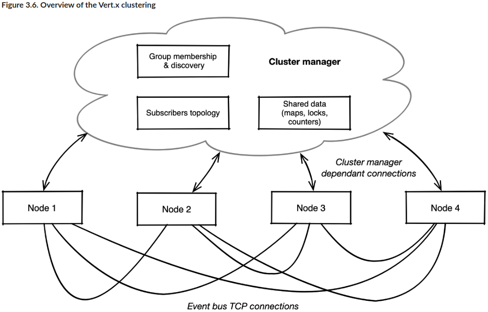

## 二、Verticle - Vertx运行的基本单位

### 基础

Verticle作用类似EJB，能够被发布，也有生命周期。

Verticle还和actors模式的actor有很多相似之处，比如维护自己的私有状态，通过事件或消息进行交流等。但不能说Verticle就是实现了actor模式，只能说受到启发而已。

Vertx使用Netty自带的log，相当冗长，如果需要减少日志，我们可以在创建src/main/resources/logback.xml文件进行覆盖。

由于Vertx是一个库，而不是一个框架，因此我们可以通过main方法或者任何其它地方创建并发布verticle

一个Verticle实例总是在相同的线程上执行任务，因此不会有线程安全问题。

比如下面的verticle，定时器和httpserver的回调最终都会是verticle的线程来执行。

```java
public class HelloVerticle extends AbstractVerticle {
  private final Logger logger = LoggerFactory.getLogger(HelloVerticle.class);
  private long counter = 1;

  @Override
  public void start() {
    vertx.setPeriodic(5000, id -> {
      logger.info("tick");
    });

    vertx.createHttpServer()
      .requestHandler(req -> {
        logger.info("Request #{} from {}", counter++, req.remoteAddress().host());
        req.response().end("Hello!");
      })
      .listen(8080);
    logger.info("Open http://localhost:8080/");
  }

  public static void main(String[] args) {
    Vertx vertx = Vertx.vertx();
    vertx.deployVerticle(new HelloVerticle());
  }
}
```

- Verticle是跑在EventLoop中的，因此不能让Verticle发生阻塞。否则会降低EventLoop线程的吞吐量，造成代码阻塞
- Vertx有一个后台运行的EventLoop checker，当阻塞超过两秒（时间可调）时，会报警。但它不会杀掉kill handler
- Verticle的带Promise参数的start能够通知Verticle发布是否成功，但不带参的start则无法通知其发布是否成功。
- 尽管一个verticle可以发布更多verticle，这听起来有层次，但在Vertx中vertciel并没有正式的父子的概念。
- 尽管一个Verticle可以发布多个verticle，但被发布的verticle不一定和发布它的verticle在同一个EventLoop线程上运行。
- EventLoop线程的数量，默认是CPU核心数的两倍。当verticle数超过最大线程数时，线程将被共享。

### 执行阻塞操作

两种方式

- 定义WorkerVerticle，即DeploymentOptions.setWorker(true)。它和普通Verticle相同的是发布方法。不同的是它是运行在Worker-thread线程上的，而不是event-loop线程。且一个verticle可能在多个worker-thread上运行。
- 使用executeBlocking()。WorkerVerticle适合比较多的逻辑，当只需要一小部分逻辑时，使用本方法。他也是在worker-thread上执行，完成后再将接口还给event-loop

### Verticle到底是什么

简单来说，Verticle由两部分组成（看源码也能看到）

- 它所属的Vertx实例（一个Vertx实例拥有多个Verticle）

  Vertx实例是核心，用于提供核心API，一个Vertx实例被多个Verticle共享。一般来说，每个JVM中只会有一个Vertx实例

- 与其绑定的Context实例，用于将事件分发到各个handler中

  Context持有对当前Verticle的线程的访问方式，因为事件可能触发自其他的源（甚至线程）。正是Context才让事件被分发到用户定义的handler中被处理。

  从源码上看，一个Context是和当前Verticle的线程绑定的。

WorkerVerticle也差不多，只不过Context会控制它在worker-thread中执行

### getOrCreateContext()

- 当它在一个context thread，比如一个Verticle中被调用时，返回的是当前线程的Context
- 当在一个非context thread，比如不再verticle中，直接调用，则会创建一个新的Context

为什么命名调用的是vertx.getOrCreateContext()，却能知道是当前Verticle的Context ?

因为Context是和Thread绑定的，而该方法原理就是通过线程获取，因此能够得到。

### Context

有一个重要的原则，每个Verticle必然包含一个Context，并且是不同的Context，即：在一个Verticle中发布一个新的Verticle，这个新的Verticle会绑定到一个新创建的Context

在这个Verticle内部，所有的回调调度都又该Context完成。

### 将Vertx和其它线程模型桥接

Context提供runOnContext()方法，允许我们执行

## 三、EventBus - Vertx应用的中枢

### EventBus是什么

EventBus用于verticle之间异步传输数据。传输的数据一般由如下几个点组成

- 可选的头部信息，用于执行元数据
- 必选的消息体，一般使用字符串或JSON传输。当然也可以自定义codec实现任意传输，但JSON可以覆盖大多数场景
- 可选的过期时间，超过该时间还没得到响应将产生超时错误

EventBus的好处是在Verticle之间解耦，两个Verticle甚至可以使用不同语言编写、甚至不在一个JVM中

EventBus还有一个特别厉害的特性是它可以和Vertx应用之外的消息broker交流

### EventBus和一个普通的message broker有啥区别

它并不是一个message broker，它仅用于Verticle内部的事件传送。而这个事件是可能丢失的。我们可以用kafka之类的真正message broker中间件来存储不希望丢失的数据。

注意，EventBus是尽可能不丢失数据，但不能保证百分百不丢失。

### EventBus支持的模式

- 点对点传输
- 请求-响应
- 发布-订阅

### 集群和分布式的工作方式

集群结构如下



- Group membership & discovery 负责侦测新加入和新退出的节点，并维护工作节点
- Shared data在集群范围内共享。其中分布式锁用于节点之间进行同步

### 支持的集群管理引擎

Vertx支持如下引擎，他们之间在功能上完全一样。因此我们需要根据自己的需求进行选择。

- Hazelcast，由于历史原因，它是Vertx的默认引擎。其它引擎是后面才加入的。
- Infinispan
- Apache Zookeeper
- Apache Ignite

### 分布式EventBus

Vertx可以实现两个实例之间透明地交流，只需要引入集群管理器依赖和简单配置即可

```java
Vertx.clusteredVertx(options, res -> {
  if (res.succeeded()) {
    Vertx vertx = res.result();
    EventBus eventBus = vertx.eventBus();
    System.out.println("We now have a clustered event bus: " + eventBus);
  } else {
    System.out.println("Failed: " + res.cause());
  }
});
```

如果要详细的集群配置，可以查看手册

## 四、异步数据和事件流

### 统一的流模型

很多事件是需要被连续处理，比如Http的body可能由几个事件传输而来，Vertx提供了统一的流模型

流模型分为Read Stream和Write Stream，以HttpServer为例，Request是Read Stream，Response是WriteStream

对应的接口分别为ReadStream和WriteStream，看起来像是没用过，看看他们的接口就知道了

ReadStream

| Method                      | Description                                                  |
| --------------------------- | ------------------------------------------------------------ |
| `handler(Handler)`          | Handle a new read value of type `T` (e.g., `Buffer`, `byte[]`, `JsonObject`, etc). |
| `exceptionHandler(Handler)` | Handle a read exception.                                     |
| `endhandler(Handler)`       | Called when the stream has ended, either because all data has been read, or because an exception was raised. |

WriteStream

| Method                      | Description                                                  |
| --------------------------- | ------------------------------------------------------------ |
| `write(T)`                  | Write some data of type `T` (e.g., `Buffer`, `byte[]`, `JsonObject`, etc). |
| `exceptionHandler(Handler)` | Handle a write exception.                                    |
| `end()`                     | Ends the stream.                                             |
| `end(T)`                    | Write some data of type `T` then end the stream.             |

再看一个文件读取的代码，没错，读取文件是一个读流

```java
public static void main(String[] args) {
  Vertx vertx = Vertx.vertx();
  OpenOptions opts = new OpenOptions().setRead(true);
  vertx.fileSystem().open("build.gradle", opts, ar -> {
    if (ar.succeeded()) {
      AsyncFile file = ar.result();
      file.handler(System.out::println)
        .exceptionHandler(Throwable::printStackTrace)
        .endHandler(done -> {
          System.out.println("\n--- DONE");
          vertx.close();
        });
    } else {
      ar.cause().printStackTrace();
    }
  });
}
```

### 背压

ReadStream和WriteStream都提供背压相关方法

ReadStream

| Method        | Description                                                  |
| ------------- | ------------------------------------------------------------ |
| `pause()`     | Puts the stream in pause, preventing further data to be sent to the handler. |
| `resume()`    | Starts reading data again and sending it to the handler.     |
| `fetch(long)` | Demand a number `n` of elements to be read (at most). The stream must have been paused before calling `fetch(n)`. |

WriteStream

| Method                      | Description                                                  |
| --------------------------- | ------------------------------------------------------------ |
| `setWriteQueueMaxSize(int)` | Defines what the maximum write buffer queue size should be like before being considered as *full*. This is a size in terms of queued Vert.x buffers to be written, not a size in terms of actual bytes as the queued buffers may be of different sizes. |
| `boolean writeQueueFull()`  | Indicates when the write buffer queue size is *full*.        |
| `drainHandler(Handler)`     | Defines a callback when the write buffer queue has been *drained*, typically when it is back to half of its maximum size. |

## 五、回调之外

本章介绍了三种比普通回调更好的处理方式

- Future / Promise
- RxJava
- Kotlin Coroutine

## 六、Event-Bus之外

很多时候可能想要将事件总线服务暴露成一个接口，而不是普通的消息回调函数。Vertx提供了这样的功能。

Vertx提供了ServiceProxy的功能，能够将一个传统的类型的Service通过代码生成的方式暴露成事件总线上的服务，从而为代码编写提供了帮助。

## 七、设计一个响应式的应用

### 一个应用怎么就响应式了

一个满足响应式宣言的应用，就是响应式的。就像第一章所提到的

- elastic 弹性，可以任意伸缩扩展
- resilient 韧性，某个服务挂了并不会影响应用状态
- responsive 响应，被请求时延迟应在可控范围内
- message-driven 消息驱动，服务之间消息驱动，互不耦合

其中responsive是最重要的一个特性，它意味着即使在大载荷和面临服务故障时应用依然可以良好地响应用户请求，并将响应时间控制控制在一定时间内，比如500ms

### Vertx如何提供响应式服务

Vertx基于Netty，采用EventBus的形式，首先解决了利用较少硬件资源负载大量载荷的问题；同时也满足消息驱动特性。利用它构建的无状态服务可以任意部署多少个。需要用户处理的问题就是：resilient——韧性，即当服务出错或无响应时，应该如何应对。

你可能会想，当服务出错时，那就报错就好了呀。但这不一定是最好的方案，我们还可以选择重试、或者使用上一次请求结果+时间戳的方式进行返回，一切看业务需求。

