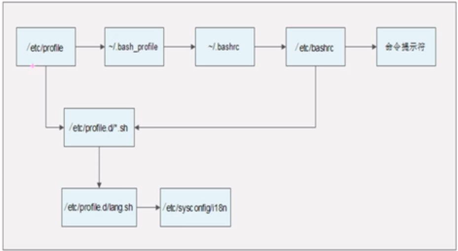

# 常用命令

i节点？

## 文件查看

- cat  显示所有内容
- more 一页一页地显示内容，只能向下翻页
- less  一页一页地显示内容，也能向上翻页，还能进行搜索，搜索方式和vim差不多
- head 看前几行
- tail 看最后几行

## 文件链接

- 软链接

  类似windows的快捷方式，执行的实际上是源文件。软连接文件对所有用户都有所有权限，即rwxrwxrwx，具体执行时还是看源文件的权限

  ln -s 链接目标文件 链接名

  如果源文件删除，软连接无法运行

- 硬链接

  相当于cp -p，即带属性拷贝，再加上同步更新。源文件更新了链接文件会同步更新

  ln 链接目标文件 链接名

  如果源文件被删除，硬链接还能访问

  源文件的i节点和硬链接的i节点是同一个，因此其内容可以同步，但正因如此，所以无法跨分区链接，也不能针对目录使用

## 权限管理

- chmod

只能文件所有者和管理员能够修改文件权限

```bash
chmod u+x 文件名 # 为所有者增加执行权限
chmod o-rw,g+x 文件名 # 为其它用户去除读写权限，用户组增加执行权限
chmod 777 文件名 # 为所有用户配置所有权限

chmod -R 777 目录名 # 将目录及其子目录和子文件权限都改为777
```

文件和目录权限的区别

| 权限 | 文件         | 目录                     |
| ---- | ------------ | ------------------------ |
| r    | 读文件       | 可列出目录中的内容       |
| w    | 修改文件内容 | 可在目录中创建和删除文件 |
| x    | 执行文件     | 可以进入这个目录         |

上面可以看到，删除文件的权限取决于对该文件所属目录的权限

- chown

改变文件所有者，只有管理员可以改变文件所有者

```bash
chown 新的所有者 文件名 # 将一个文件所有者改为指定用户
```

- chgrp

改变文件所属组，只有管理员可以操作

```bash
chgrp 新的组 文件名
```

**linux中默认创建的文件都没有可执行权限**

## 文件搜索 

### find

find搜索原理是遍历文件系统，很耗资源，范围越小越好，最好不要使用

find [搜索范围] [匹配条件]

- 根据名称查找

```bash
find /etc -name init # 在/etc文件夹下，搜索名称为init的文件，精确匹配，区分大小写
find /etc -iname init # 不区分大小写
find /etc -name *init* # 搜索包含init
find /etc -name init??? # init开头，后面有三个字幕的
```

- 根据大小查找

```bash
find /etc -size +100 #查找大于100个数据块的文件，1数据块=512Byte
```

- 根据所有者查找

```bash
find /etc -user www # 查找用户www的所有文件
```

- 根据时间查找

```bash
find /etc -amin -5 # 5分钟内被访问过的文件
find /etc -cmin +5 # 5分钟前被修改过属性的文件
find /etc -mmin -5 # 5分钟内被修改过内容的文件
```

- 条件组合

```bash
-a # 两个条件同时满足
-o # 两个条件满足一个即可
```

- 作为其他命令的输入

```bash
find /etc -name inittab -exec ls -l {} \; # 查找inittab文件并显示其详细内容
find /etc -name inittab -ok ls -l {} \; # 和上面类似，只不过每一句执行时都会询问
```

### locate

locate类似windows的everything，是创建了一个资料库，搜索速度很快

缺点

- 不会收录tmp文件夹下内容
- 不会及时自动更新，新建的文件可能找不到，此时用updatedb命令手动更新

```bash
locate hello # 查找名为hello的文件
```

### which

搜索命令所在目录及别名信息

```bash
which ls
```

### whereis

搜索命令所在目录，及帮助文件所在位置，还有配置文件所在位置

```bash
whereis ls
```

### grep

在文件中搜索字符串匹配的行并输出

grep -iv [指定字符串] [文件]

-i 不区分大小写

-v 排除指定字符串

```bash
grep ERROR hulaqinzitagging-celery-worker.log
grep -v ^# nginx.conf # 在文件中查找以除去#开头的所有行的数据
```

## 帮助

### man

可以查看命令的帮助信息，也可以查看配置文件的帮助信息

```bash
man ls # 查看ls的帮助文档

man 配置文件 # 查看命令
```

一般的帮助文档，1.gz是命令的帮助，5.gz是配置文件的帮助

```bash
floyd@floyd-ThinkPad-T490:~$ whereis passwd
passwd: /usr/bin/passwd /etc/passwd /usr/share/man/man5/passwd.5.gz /usr/share/man/man1/passwd.1.gz /usr/share/man/man1/passwd.1ssl.gz
```

### whatis

查看命令是干嘛用的

```bash
floyd@floyd-ThinkPad-T490:~$ whatis ls
ls (1)               - list directory contents
```

### apropos

 搜索手册页名称和描述

### info

和man差不多，只不过显示方式不一样而已

### help

可以查看shell内置命令的帮助信息

```bash
floyd@floyd-ThinkPad-T490:~$ help cd
cd: cd [-L|[-P [-e]] [-@]] [目录]
    改变 shell 工作目录。
    
    改变当前目录至 DIR 目录。默认的 DIR 目录是 shell 变量 HOME
    的值。

```

## 用户管理

### useradd


### passwd


### who / w

查看当前linux系统有哪些用户登录

```bash
floyd@floyd-ThinkPad-T490:~$ who
floyd    tty7         2020-01-05 15:37 (:0)
floyd    pts/0        2020-01-05 15:37 (:0)

floyd@floyd-ThinkPad-T490:~$ w
 15:53:41 up 17 min,  2 users,  load average: 2.40, 2.29, 1.90
USER     TTY      来自           LOGIN@   IDLE   JCPU   PCPU WHAT
floyd    tty7     :0               15:37   17:06   1:53   0.14s /usr/lib/gnome-session/gnome-session-binary --session=pantheon
floyd    pts/0    :0               15:37    0.00s  0.15s  0.00s w
```

### uptime

系统启动时间查看

```bash
floyd@floyd-ThinkPad-T490:~$ uptime
 15:54:16 up 17 min,  2 users,  load average: 2.21, 2.25, 1.90
```

## 压缩和解压

### gzip/gunzip

不用加什么参数，直接gzip + 文件名即可

gzip只能压缩文件，不能压缩目录，且压缩文件后原文件就丢了

打包后的文件名为后缀为.gz

### tar

压缩和打包是两个步骤，tar管的是打包，压缩使用的是gzip或bzip2做到的

tar [-cvf] 压缩后的文件 待压缩的目录

压缩打包

-c 打包

-v 显示详细信息

-f 指定文件名

-z 打包同时使用gzip压缩

-j 打包同时使用bzip2压缩

```bash
tar -zcf xxx.tar.gz 待打包目录
tar -jcf xxx.tar.bz2 待打包目录
```

解包解压缩

-x 解包

-v 显示详细信息

-f 指定解压文件

-z 解压缩

```bash
tar -zxvf xxx.tar.gz
```

### zip/uzip

相对gzip，可以压缩目录，压缩后文件名也会保留

使用方式和tar类似

-r 压缩目录

###  bzip2

相对gzip，保留原文件，且压缩比非常好

后缀为.bz2

## 网络命令

- write: 向本机另一个用户发送信息
- wall: 向本机其它所有用户发送信息

### ping

发送ICMP ECHO_REQUEST到一个主机

默认情况下会一直ping下去，加-c参数可以限定次数

### ifconfig

interface config

查看和设置网卡信息

### mail

查看和发送邮件，在linux系统内部分发送

### last

查看最近登陆过的用户记录

### lastlog

查看每个用户最后一次登录的信息

### traceroute

查看访问某个网站的所有路由信息

### netstat

显示网络相关信息

-t TCP协议

-u UDP协议

-l 监听

-r 路由

-n 显示IP地址和端口号

```bash
netstat -tln # 查看本机的TCP监听端口
netstat -an # 查看所有连接
netstat -rn  # 查看本机路由表
```

## 挂载

mount 磁盘设备 挂载点

umount 磁盘设备

## 关机重启

###　 shutdown

推荐使用shutdown

shutdown [选项]　时间

-c 取消前一个关机命令

-h 关机

-r 重启

### hult

### poweroff

直接断电

### reboot

### 系统运行级别

- 0 关机
- 1 单用户: 类似于windows的安全模式，排查问题时可能进入
- 2 不完全多用户，不包含NFS服务
- 3 完全多用户
- 4 未分配
- 5 图形界面
- 6 重启

#### 运行级别配置文件

```bash
cat /etc/inittab
```

#### 查看当前运行级别

```bash
runlevel
```

#### 切换运行级别

```bash
init [运行级别号]
```

### logout

离开电脑时要习惯使用logout进行登出


# Vim编辑器

### 进入插入模式

六个命令：a A i I o O

## 定位

- :set nu 显示行号
- :set nonu 取消行号
- gg 到第一行
- G 到最后一行
- nG 到第n行
- :n 到第n行
- $ 到行尾
- 0 到行首

## 删除

- x 删除光标所在字符
- nx 删除光标开始的n的字符
- dd 删除当前行
- dG 删除当前行到文件末尾
- D 删除光标所在到行尾
- :n1,n2d删除n1行到n2行

## 复制

- yy 复制当前行
- nyy 复制n行
- dd 剪切当前行
- ndd 剪切n行
- p 粘贴到下一行
- P 粘贴到上一行

## 替换和取消

- r 替换当前字符
- R 从光标处开始替换字符，ESC结束
- u 撤销

## 搜索

- /string 搜索字符串
- :set ic 搜索时忽略大小写
- :set noic 搜索时区分大小写，默认
- n 搜索装天下的next
- :%s/old/new/g 全文替换
- :n1,n2s/old/new/g 指定范围替换

## 导入

### 导入其它文件

```bash
:r 文件路径
```

### 导入命令执行结果

```bash
:r !命令 # 导入命令执行结果
```

### 不退出vim的情况下执行命令

```bash
:!命令 # 在不退出vim的情况下执行命令
```

## 自定义快捷键

```bash
:map ctrl+/ I#ESC 自定义注释快捷键
```

## 修改VIM配置文件

直接修改vim配置文件vimrc，在其中加入编辑模式命令，这样每次打开vim都会生效

比如在最后一行加上 set nu，每次打开vim都会有行号了。

# Shell基础

shell就是应用与系统内容交互的解释器

shell又指shell语言，是脚本语言，在shell中可以调用系统命令

Shell有两种语法类型，Bourse和C，主流使用的Bash属于Borse这种类型中

查看支持哪种shell，可以查看/etc/shells文件

## echo

- echo 输出内容，可以指定输出的颜色
  - -e 可输出转义字符

## 第一个脚本

```bash
#!/bin/Bash   这一行是必须的，声明这是一个bash文件
```

## 执行shell脚本

有两种执行方式

1. 将sh文件修改为可执行，然后通过./xxx.sh的方式执行
2. 直接通过bash命令执行

## history

查看执行命令的历史记录

## 别名

alias

使用方式

```shell
# 单独alias可以显示当前的别名设置
alias
# 添加一个新的别名
alias  vi = 'vim'
```

### 让别名永久生效

修改 .bashrc文件

## 比较有用的快捷键

| 快捷键   | 用途                         |
| -------- | ---------------------------- |
| crtl + A | 将光标移动到命令行开头的位置 |
| ctrl + E | 将光标移到行尾               |
| ctrl + L | 清屏                         |
| ctrl + U | 剪切光标之前的内容           |
| ctrl + Y | 粘贴刚才剪切的内容           |
| ctrl + R | 从历史命令中搜索             |
|          |                              |
|          |                              |

## 输入输出

### 标准输入输出

| 设备   | 设备文件名  | 文件描述符 | 类型         |
| ------ | ----------- | ---------- | ------------ |
| 键盘   | /dev/stdin  | 0          | 标准输入     |
| 显示器 | /dev/stdout | 1          | 标准输出     |
| 显示器 | /dev/stderr | 2          | 标准错误输出 |

### 输出重定向

标准输出覆盖

```shell
命令 > 文件 # 覆盖到目标文件
命令 >> 文件 # 追加到目标文件
命令 2> 文件 # 将错误输出覆盖到目标文件
命令 2>> 文件 # 将错误输出追加到目标文件
命令 > 文件 2>&1 # 将命令结果覆盖到目标文件，同时将错误输出重定向到标准输出
```

### 输入重定向

```shell
命令 < 文件 # 将文件内容作为命令的输入
```

## 一个不管命令执行错误的好方法

```shell
命令 &> /dev/null 
```

## 多命令顺序执行

 

| ;    | 命令1;命令2    | 命令顺序执行，但命令之间没有逻辑关系                         |
| ---- | -------------- | ------------------------------------------------------------ |
| &&   | 命令1&&命令2   | 逻辑与，存在短路；只有前面的命令执行完成之后，后面的命令才会执行 |
| \|\| | 命令1\|\|命令2 | 逻辑或，存在短路；前面的命令执行不正确，后面的命令才会执行   |

## 管道符

命令1的正确输出作为命令2的操作对象

```shell
ls | grep hello # 将ls输出作为grep的输出
```

## 通配符及其它符号

linux中的通配符和正则表达式中的通配符是一样的。

```bash
# 这里举例一些
ls abc*  # 列出以abc为开头的所有文件和文件夹
ls ?abc? # 列出包含abc，且前后最多有一个字符的所有文件和文件夹
```

下面列出其它特殊符号

| ''   | 单引号，在单引号中的所有内容都没有特殊含义                   |
| ---- | ------------------------------------------------------------ |
| ""   | 双引号，在双引号中的所有内容没有特殊含义，但$ ` \ 三个字符是例外 |
| ``   | 反引号，在其中的内容是系统命令                               |
| $()  | 和上面一样，用来引用系统命令                                 |
| $    | 用于调用系统变量                                             |
| \    | 转义符                                                       |

## 变量

环境变量建议大小写

### 变量分类

变量主要有以下种类，从上到下依次减少

- 用户自定义变量，也称作本地变量，仅在当前shell生效
- 环境变量：保存和系统环境操作相关的数据
- 位置变量参数：变量名不能自定义，变量作用固定
- 预定义变量：Bash中已定义好的变量，变量作用是固定的

### 用户自定义变量

```bash
# 定义一个变量
$ name=floyd
# 调用上面定义的变量
$ echo $name
```

#### 查看所有变量 - set

```bash
$ set
```

#### 取消/删除变量 - unset

```bash
$ unset name
```

### 环境变量

环境变量的生效范围在当前shell和子shell生效

#### 设置环境变量

```bash
$ export 变量名=变量值
```

#### 查询所有环境变量

```bash
$ env
```

#### 取消环境变量

```bash
$ unset 变量名
```

#### 变量叠加

```bash
# 向PATH中加入一个新的路径
$ PATH="$PATH":/root
```

#### PS1

用于设置如下这个东西的


### 位置参数变量

用于获取执行shell脚本时传入的参数

- $n - 获取第几个参数， \$0代表命令本身
- $* - 获取所有参数，但将所有参数当做一个整体对待，不包括命令本身
- $@ - 获取所有参数，但将每个参数区分对待，不包括命令本身
- $# - 获取所有参数的个数，不包括命令本身

### 预定义变量

系统事先定义的变量，不可更改

- $? - 获取最后一次执行的命令的返回状态
- $$ - 获取当前进程的进程号
- $! - 获取运行的最后一个进程的进程号

### 接收键盘输入

read [选项] [变量名]

-P "提示信息" 输出提示信息

-t 等待的最长时间

-n 输入的字符数满足时马上执行，不用等待

-s 输入时不做显示，其实已经输入成功了

## 运算符

### 数值运算和运算符

在linux shell中，对待所有变量都会被当做字符串。因此执行 `$age1 + $age2`这样的脚本得到的是字符串拼接，而不是进行值的计算。要进行数值计算，需要使用特殊的方式。

有三种特殊的方式，比如declare、expr等，但最常用的是如下方式。

```bash
$ ff = $(( $aa + $bb ))
```

运算符方面，和常规的语言是一样的。

## 环境变量及配置文件

### source

用于马上使配置文件生效

### 环境变量配置文件

总共有如下几处配置文件，他们的作用可以看里面的具体内容

- /etc/profile
- /etc/profile.d/*.sh
- ~/.bash_profile
- ~/.bashrc
- /etc/bashrc

### 配置文件加载顺序



### 其它配置文件

- ~/.bash_logout   注销时生效的配置文件
- ~/.bash_history  历史命令
- /etc/issue  本地终端欢迎信息
- /etc/issue.net  远程终端欢迎信息，该文件中的转义符不会生效

#  Shell高级

### cut

只获取每行的部分文本。怎么用自己查看帮助文档去。

### printf

按照指定格式输出指定内容

### awk

是一种强大的文本分析工具

### sed


# 服务管理


# 系统管理


# 日志管理


# 启动管理


# 备份与恢复


# 有用的其它命令

### pstree

查询进程树