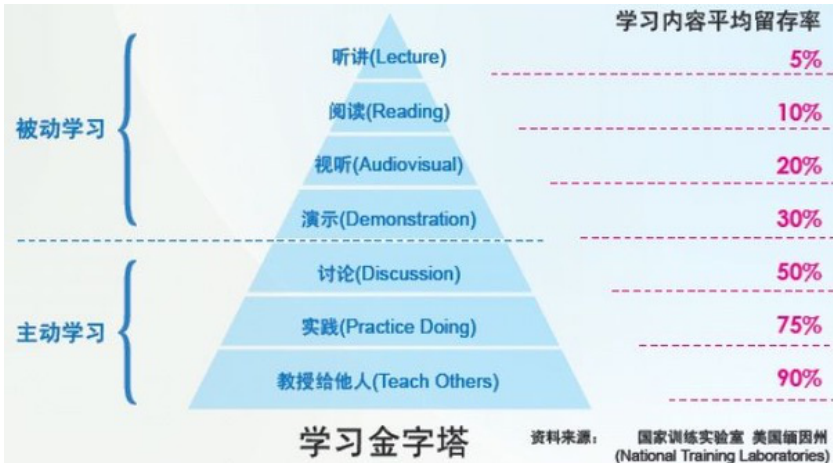
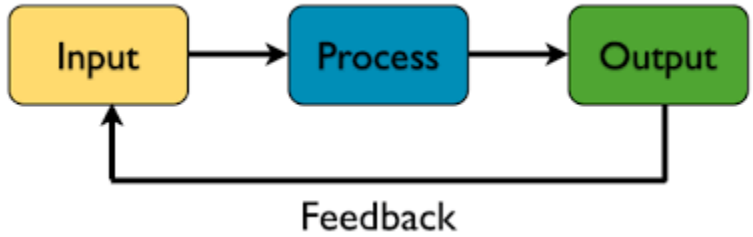

# 全栈增长工程师指南

## 学习金字塔

学习任何一个东西，如果只是看过了，仅仅是处在学习金字塔的最小部分，离掌握还远远不够。

如果你不试着去写点博客、整理资料、准备分享，那么你可能并没有意识到你缺少了多少东西。虽然你已经有了很多的实践，然并卵。因为你⼀直在完成功能、完成⼯作，你总会有意、⽆意地漏掉⼀些知识，⽽你也没有意识到这些知识的重要性。

博文写作过程中，我发现需要更多的参考资料来完善相关的内容。此时**输出强制带来了更多输入，并且会加速这个过程。**

如果下次有⼈问你如果学⼀门新语⾔、技术，那么答案就是写⼀本书。

学习⼀门新的技术的最好实践就是⽤这门技术对现有的系统⾏重写。

对于很多人而言，学习一门新技术最快速的方式就是用它重写已经被自己重写过无数次的博客系统。

## 总结

这本书像是一个长篇博客，对所有内容没有一点深入，介绍了几年前的前后端的主要技术架构，设计到方方面面，参考价值非常有限。

